# CIRA TBR Tracker

> Automated archive and analytics for CIRA **To-Be-Released (TBR)** `.CA` domain
> drop sessions. Updated every **Wednesday ≈ 19:30 UTC** via GitHub Actions.

**Last updated:** 2026-05-27 &nbsp;|&nbsp; **Total sessions tracked:** 7

---

## What is TBR?

CIRA releases expired `.CA` domains every **Wednesday at 19:00 UTC** via a
first-come, first-served process. Whichever registrar submits a registration
request first wins the domain (one connection, one request per 5 s per registrar).

Capture latency is measured from the official session open at **19:00:00.000 UTC**.

---

## Last Session

- **Date:** 2026-05-27
- **Domains released:** 168
- **Domains registered:** 168
- **Registration rate:** 100.0%
- **Unique registrars:** 8
- **Session duration:** 604,916 ms
- **Market concentration (HHI):** 4,139.0

**Capture latency across all registrars:**
- Min: 6 ms | Median: 6976 ms | Mean: 11464.3 ms | P95: 13480 ms | Max: 604922 ms

**Per-registrar latency breakdown:**

| Registrar | Domains | Min (ms) | Median (ms) | Mean (ms) | P95 (ms) | Max (ms) | StdDev (ms) |
|-----------|--------:|---------:|------------:|----------:|---------:|---------:|------------:|
| WHC Online Solutions Inc. | 99 | 56 | 9942 | 8966.2 | 13497 | 14965 | 3386.5 |
| BareMetal.com inc | 39 | 23 | 6801 | 7145.8 | 11833 | 11928 | 3771.7 |
| MyID.ca INC. | 17 | 11 | 514 | 37772.4 | 604922 | 604922 | 146174.7 |
| Register.ca Inc. | 8 | 6 | 169 | 246.5 | 559 | 559 | 239.4 |
| Webnames.ca Inc. | 2 | 46864 | 54386 | 54386 | 61908 | 61908 | 10637.7 |
| DomainePlus.com (3612040 CANADA inc.) | 1 | 32 | 32 | 32 | 32 | 32 | 0 |
| Grape Inc. | 1 | 42 | 42 | 42 | 42 | 42 | 0 |
| Namespro Solutions Inc. | 1 | 6722 | 6722 | 6722 | 6722 | 6722 | 0 |

**Timing distribution (captures by second offset from 19:00:00 UTC):**

| Offset (s) | Domains Captured |
|-----------:|-----------------:|
| +0 | 29 |
| +1 | 2 |
| +4 | 1 |
| +5 | 23 |
| +6 | 31 |
| +7 | 10 |
| +8 | 4 |
| +9 | 1 |
| +10 | 17 |
| +11 | 28 |
| +12 | 9 |
| +13 | 9 |
| +14 | 1 |
| +46 | 1 |
| +61 | 1 |
| +604 | 1 |

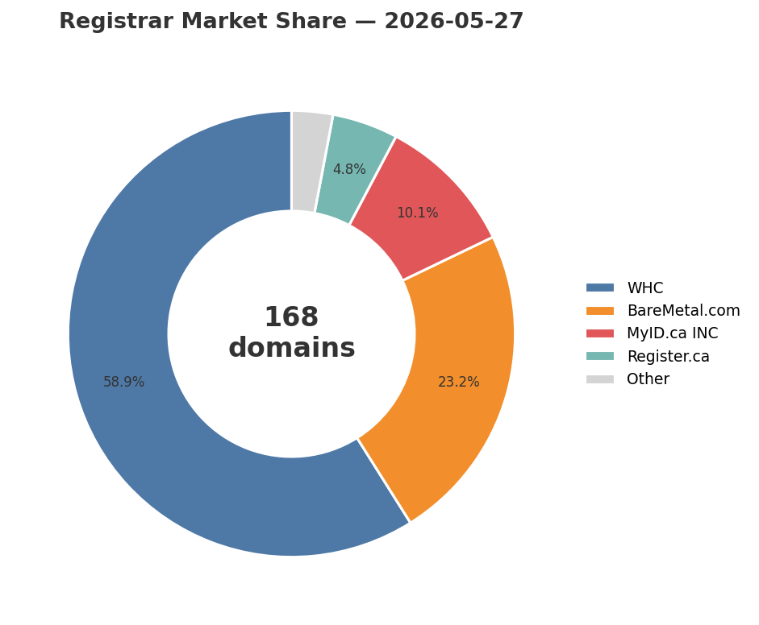

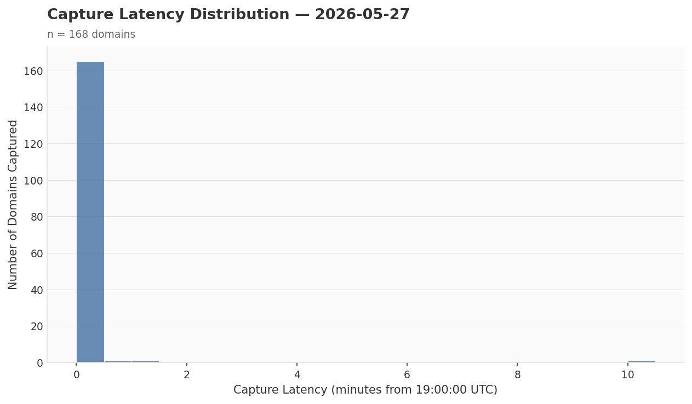

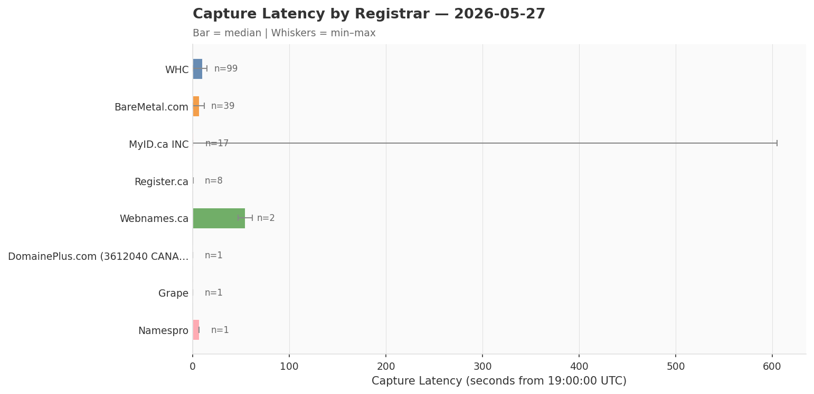

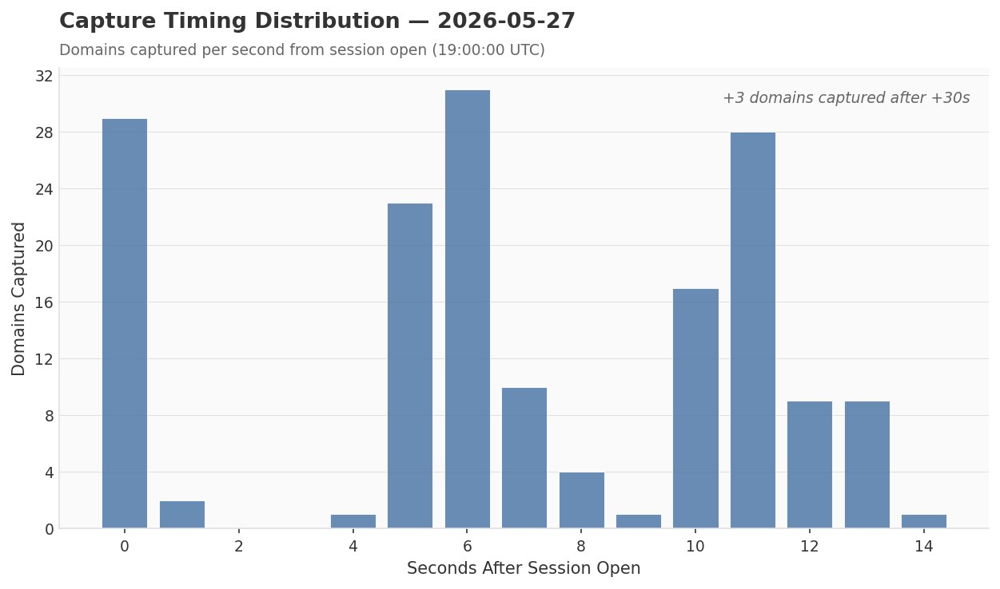

---

## Rolling Windows

### Last 4 Sessions

- **Sessions covered:** 4  (2026-05-06 → 2026-05-27)
- **Total domains registered:** 863
- **Avg domains/session:** 215.8
- **Unique registrars (ever active):** 12
- **Avg registrars/session:** 8.2
- **Market concentration HHI:** 4,411.2

| Registrar | Domains | Share | Sessions Active | Mean Latency (ms) |
|-----------|--------:|------:|----------------:|------------------:|
| WHC Online Solutions Inc. | 530 | 61.41% | 4 | 9509.0 |
| BareMetal.com inc | 210 | 24.33% | 4 | 11662.0 |
| Webnames.ca Inc. | 40 | 4.63% | 4 | 97153.4 |
| MyID.ca INC. | 39 | 4.52% | 3 | 15531.4 |
| Register.ca Inc. | 19 | 2.2% | 2 | 999.5 |
| Grape Inc. | 5 | 0.58% | 3 | 49.7 |
| 8648255 CANADA LTD. O/A Dynadot LLC | 5 | 0.58% | 2 | 47995.1 |
| DomainePlus.com (3612040 CANADA inc.) | 5 | 0.58% | 4 | 735.9 |
| Namespro Solutions Inc. | 3 | 0.35% | 2 | 17200.2 |
| PlanetHoster | 3 | 0.35% | 2 | 2718.8 |
| easyDNS Technologies Inc. | 3 | 0.35% | 2 | 12175.8 |
| CanSpace Solutions Inc. | 1 | 0.12% | 1 | 7370 |

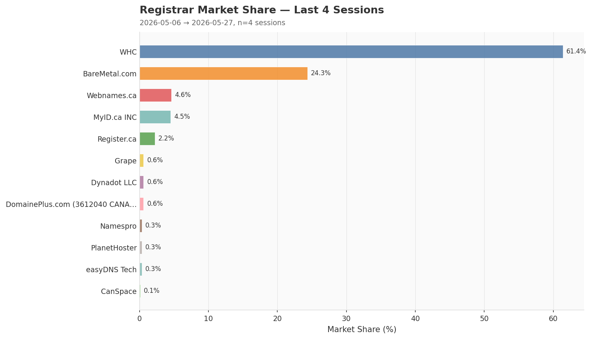

---

### Last ~6 Months (26 Weeks)

- **Sessions covered:** 7  (2026-04-15 → 2026-05-27)
- **Total domains registered:** 1,609
- **Avg domains/session:** 229.9
- **Unique registrars (ever active):** 12
- **Avg registrars/session:** 9
- **Market concentration HHI:** 4,706.0

| Registrar | Domains | Share | Sessions Active | Mean Latency (ms) |
|-----------|--------:|------:|----------------:|------------------:|
| WHC Online Solutions Inc. | 1,042 | 64.76% | 7 | 10444.1 |
| BareMetal.com inc | 350 | 21.75% | 7 | 11866.3 |
| MyID.ca INC. | 70 | 4.35% | 6 | 10421.9 |
| Webnames.ca Inc. | 64 | 3.98% | 7 | 94528.1 |
| Register.ca Inc. | 22 | 1.37% | 4 | 3010.2 |
| 8648255 CANADA LTD. O/A Dynadot LLC | 13 | 0.81% | 5 | 33278.3 |
| DomainePlus.com (3612040 CANADA inc.) | 13 | 0.81% | 7 | 2817.1 |
| Grape Inc. | 12 | 0.75% | 6 | 902.5 |
| Namespro Solutions Inc. | 8 | 0.5% | 4 | 19218.0 |
| PlanetHoster | 7 | 0.44% | 4 | 2596.0 |
| easyDNS Technologies Inc. | 6 | 0.37% | 4 | 10854.1 |
| CanSpace Solutions Inc. | 2 | 0.12% | 2 | 239826.5 |

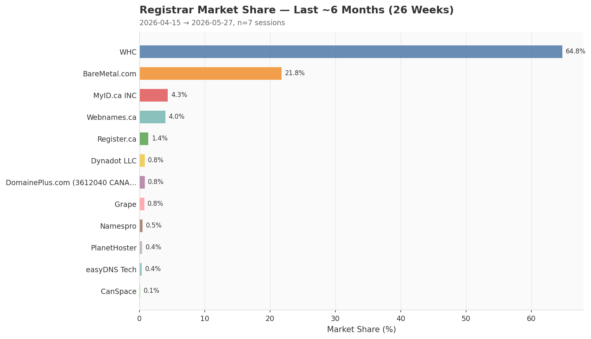

---

### Last 52 Weeks

- **Sessions covered:** 7  (2026-04-15 → 2026-05-27)
- **Total domains registered:** 1,609
- **Avg domains/session:** 229.9
- **Unique registrars (ever active):** 12
- **Avg registrars/session:** 9
- **Market concentration HHI:** 4,706.0

| Registrar | Domains | Share | Sessions Active | Mean Latency (ms) |
|-----------|--------:|------:|----------------:|------------------:|
| WHC Online Solutions Inc. | 1,042 | 64.76% | 7 | 10444.1 |
| BareMetal.com inc | 350 | 21.75% | 7 | 11866.3 |
| MyID.ca INC. | 70 | 4.35% | 6 | 10421.9 |
| Webnames.ca Inc. | 64 | 3.98% | 7 | 94528.1 |
| Register.ca Inc. | 22 | 1.37% | 4 | 3010.2 |
| 8648255 CANADA LTD. O/A Dynadot LLC | 13 | 0.81% | 5 | 33278.3 |
| DomainePlus.com (3612040 CANADA inc.) | 13 | 0.81% | 7 | 2817.1 |
| Grape Inc. | 12 | 0.75% | 6 | 902.5 |
| Namespro Solutions Inc. | 8 | 0.5% | 4 | 19218.0 |
| PlanetHoster | 7 | 0.44% | 4 | 2596.0 |
| easyDNS Technologies Inc. | 6 | 0.37% | 4 | 10854.1 |
| CanSpace Solutions Inc. | 2 | 0.12% | 2 | 239826.5 |

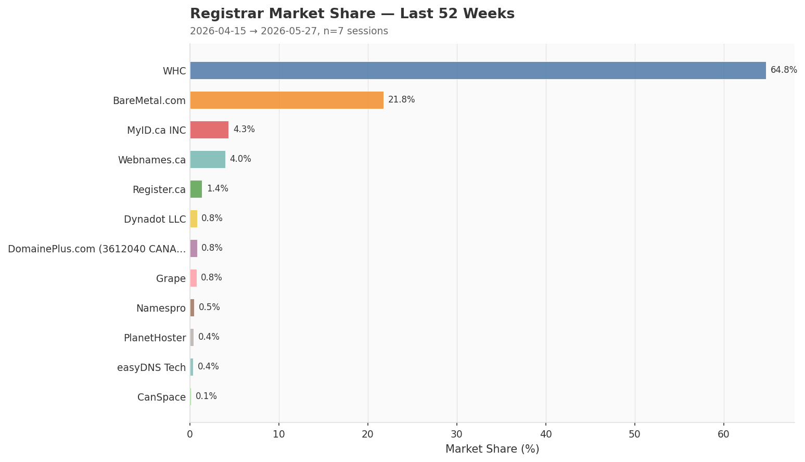

---

## All Time

- **Sessions covered:** 7  (2026-04-15 → 2026-05-27)
- **Total domains registered:** 1,609
- **Avg domains/session:** 229.9
- **Unique registrars (ever active):** 12
- **Avg registrars/session:** 9
- **Market concentration HHI:** 4,706.0

| Registrar | Domains | Share | Sessions Active | Mean Latency (ms) |
|-----------|--------:|------:|----------------:|------------------:|
| WHC Online Solutions Inc. | 1,042 | 64.76% | 7 | 10444.1 |
| BareMetal.com inc | 350 | 21.75% | 7 | 11866.3 |
| MyID.ca INC. | 70 | 4.35% | 6 | 10421.9 |
| Webnames.ca Inc. | 64 | 3.98% | 7 | 94528.1 |
| Register.ca Inc. | 22 | 1.37% | 4 | 3010.2 |
| 8648255 CANADA LTD. O/A Dynadot LLC | 13 | 0.81% | 5 | 33278.3 |
| DomainePlus.com (3612040 CANADA inc.) | 13 | 0.81% | 7 | 2817.1 |
| Grape Inc. | 12 | 0.75% | 6 | 902.5 |
| Namespro Solutions Inc. | 8 | 0.5% | 4 | 19218.0 |
| PlanetHoster | 7 | 0.44% | 4 | 2596.0 |
| easyDNS Technologies Inc. | 6 | 0.37% | 4 | 10854.1 |
| CanSpace Solutions Inc. | 2 | 0.12% | 2 | 239826.5 |

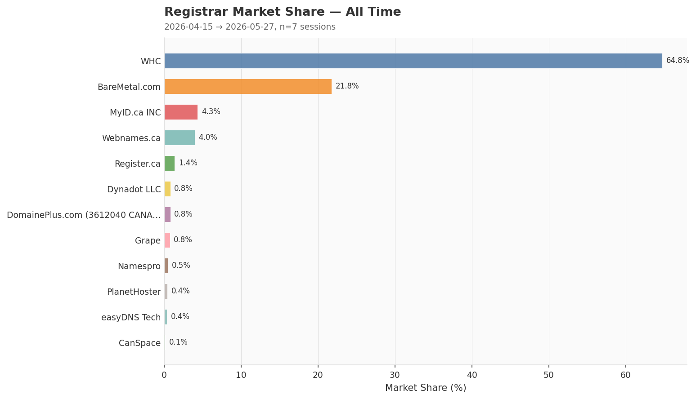

---

## Trends

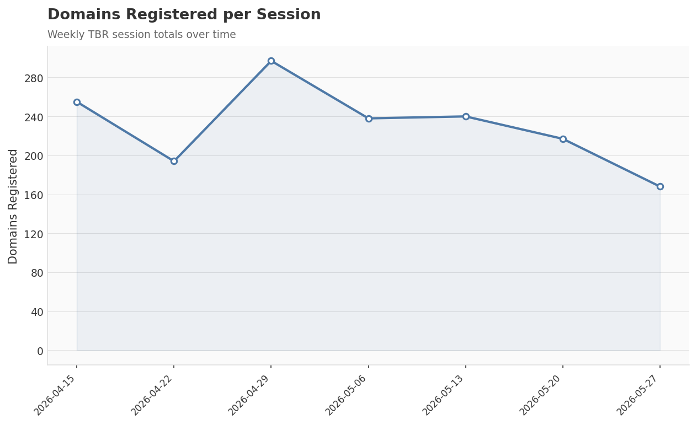

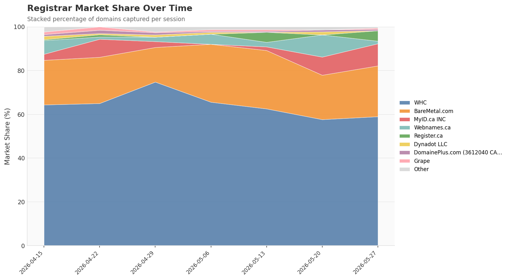

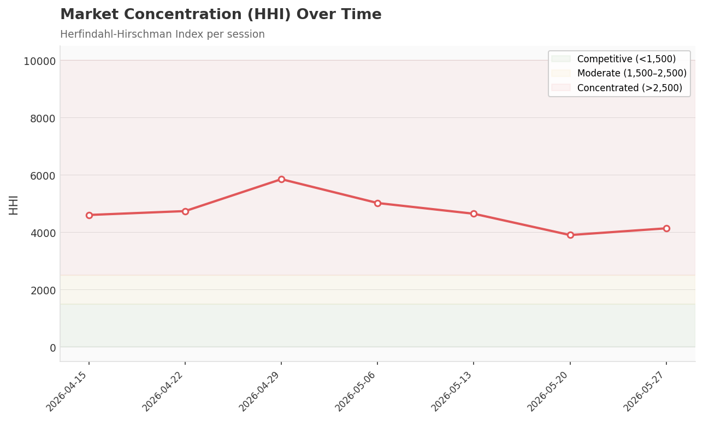

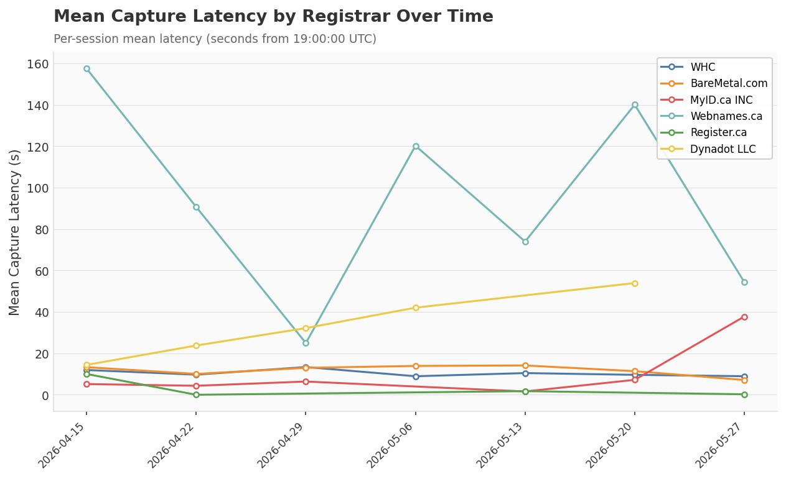

---

## By Year

### 2026

- **Sessions covered:** 7  (2026-04-15 → 2026-05-27)
- **Total domains registered:** 1,609
- **Avg domains/session:** 229.9
- **Unique registrars (ever active):** 12
- **Avg registrars/session:** 9
- **Market concentration HHI:** 4,706.0

| Registrar | Domains | Share | Sessions Active | Mean Latency (ms) |
|-----------|--------:|------:|----------------:|------------------:|
| WHC Online Solutions Inc. | 1,042 | 64.76% | 7 | 10444.1 |
| BareMetal.com inc | 350 | 21.75% | 7 | 11866.3 |
| MyID.ca INC. | 70 | 4.35% | 6 | 10421.9 |
| Webnames.ca Inc. | 64 | 3.98% | 7 | 94528.1 |
| Register.ca Inc. | 22 | 1.37% | 4 | 3010.2 |
| 8648255 CANADA LTD. O/A Dynadot LLC | 13 | 0.81% | 5 | 33278.3 |
| DomainePlus.com (3612040 CANADA inc.) | 13 | 0.81% | 7 | 2817.1 |
| Grape Inc. | 12 | 0.75% | 6 | 902.5 |
| Namespro Solutions Inc. | 8 | 0.5% | 4 | 19218.0 |
| PlanetHoster | 7 | 0.44% | 4 | 2596.0 |
| easyDNS Technologies Inc. | 6 | 0.37% | 4 | 10854.1 |
| CanSpace Solutions Inc. | 2 | 0.12% | 2 | 239826.5 |

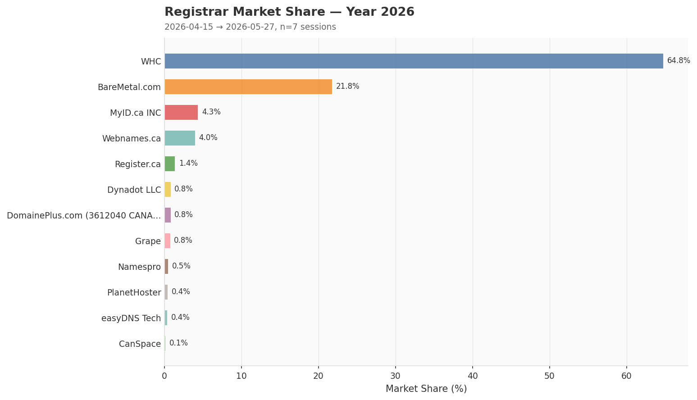

---

## By Month

#### 2026-04

- **Sessions covered:** 3  (2026-04-15 → 2026-04-29)
- **Total domains registered:** 746
- **Avg domains/session:** 248.7
- **Unique registrars (ever active):** 12
- **Avg registrars/session:** 10
- **Market concentration HHI:** 5,094.3

| Registrar | Domains | Share | Sessions Active | Mean Latency (ms) |
|-----------|--------:|------:|----------------:|------------------:|
| WHC Online Solutions Inc. | 512 | 68.63% | 3 | 11691.0 |
| BareMetal.com inc | 140 | 18.77% | 3 | 12138.8 |
| MyID.ca INC. | 31 | 4.16% | 3 | 5312.3 |
| Webnames.ca Inc. | 24 | 3.22% | 3 | 91027.8 |
| 8648255 CANADA LTD. O/A Dynadot LLC | 8 | 1.07% | 3 | 23467.1 |
| DomainePlus.com (3612040 CANADA inc.) | 8 | 1.07% | 3 | 5592 |
| Grape Inc. | 7 | 0.94% | 3 | 1755.4 |
| Namespro Solutions Inc. | 5 | 0.67% | 2 | 21235.8 |
| PlanetHoster | 4 | 0.54% | 2 | 2473.2 |
| easyDNS Technologies Inc. | 3 | 0.4% | 2 | 9532.5 |
| Register.ca Inc. | 3 | 0.4% | 2 | 5020.8 |
| CanSpace Solutions Inc. | 1 | 0.13% | 1 | 472283 |

#### 2026-05

- **Sessions covered:** 4  (2026-05-06 → 2026-05-27)
- **Total domains registered:** 863
- **Avg domains/session:** 215.8
- **Unique registrars (ever active):** 12
- **Avg registrars/session:** 8.2
- **Market concentration HHI:** 4,411.2

| Registrar | Domains | Share | Sessions Active | Mean Latency (ms) |
|-----------|--------:|------:|----------------:|------------------:|
| WHC Online Solutions Inc. | 530 | 61.41% | 4 | 9509.0 |
| BareMetal.com inc | 210 | 24.33% | 4 | 11662.0 |
| Webnames.ca Inc. | 40 | 4.63% | 4 | 97153.4 |
| MyID.ca INC. | 39 | 4.52% | 3 | 15531.4 |
| Register.ca Inc. | 19 | 2.2% | 2 | 999.5 |
| Grape Inc. | 5 | 0.58% | 3 | 49.7 |
| 8648255 CANADA LTD. O/A Dynadot LLC | 5 | 0.58% | 2 | 47995.1 |
| DomainePlus.com (3612040 CANADA inc.) | 5 | 0.58% | 4 | 735.9 |
| Namespro Solutions Inc. | 3 | 0.35% | 2 | 17200.2 |
| PlanetHoster | 3 | 0.35% | 2 | 2718.8 |
| easyDNS Technologies Inc. | 3 | 0.35% | 2 | 12175.8 |
| CanSpace Solutions Inc. | 1 | 0.12% | 1 | 7370 |

---

## Data & Files

| Path | Description |
|------|-------------|
| `data/YYYY/MM/DD.json` | Raw API response for each session |
| `tally.json` | Machine-readable aggregate statistics |
| `charts/` | Auto-generated visualizations (PNG) |
| `README.md` | This file — auto-generated each week |

---

## Metrics Glossary

| Metric | Description |
|--------|-------------|
| **Market Share %** | Percentage of session domains captured by a registrar |
| **HHI (Herfindahl-Hirschman Index)** | Market concentration; 10,000 = monopoly, <1,500 = competitive |
| **Capture Latency (ms)** | Milliseconds from session open (19:00:00.000 UTC) to domain registration timestamp |
| **Session Duration (ms)** | Time elapsed between the first and last domain captured in a session |
| **P95 Latency** | 95th-percentile capture latency — 95% of captures happened at or below this value |
| **StdDev Latency** | Standard deviation of capture latencies; lower = more consistent timing |
| **Session Presence %** | Share of sessions in which a registrar captured at least one domain |
| **Mean of Means Latency** | Average of per-session mean latencies across multiple sessions |
| **Timing Distribution** | Histogram of domain captures bucketed by second offset from session open |
| **Registration Rate %** | Fraction of released domains that were actually registered in the session |
