# CIRA TBR Tracker

> Automated archive and analytics for CIRA **To-Be-Released (TBR)** `.CA` domain
> drop sessions. Updated every **Wednesday ≈ 19:30 UTC** via GitHub Actions.

**Last updated:** 2026-09-16 &nbsp;|&nbsp; **Total sessions tracked:** 22

---

## What is TBR?

CIRA releases expired `.CA` domains every **Wednesday at 19:00 UTC** via a
first-come, first-served process. Whichever registrar submits a registration
request first wins the domain (one connection, one request per 5 s per registrar).

Capture latency is measured from the official session open at **19:00:00.000 UTC**.

---

## Last Session

- **Date:** 2026-09-16
- **Domains released:** 328
- **Domains registered:** 328
- **Registration rate:** 100.0%
- **Unique registrars:** 8
- **Session duration:** 405,689 ms
- **Market concentration (HHI):** 3,717.5

**Capture latency across all registrars:**
- Min: 18 ms | Median: 15862 ms | Mean: 36930.5 ms | P95: 230026 ms | Max: 405707 ms

**Per-registrar latency breakdown:**

| Registrar | Domains | Min (ms) | Median (ms) | Mean (ms) | P95 (ms) | Max (ms) | StdDev (ms) |
|-----------|--------:|---------:|------------:|----------:|---------:|---------:|------------:|
| WHC Online Solutions Inc. | 176 | 39 | 15630 | 14374.6 | 22282 | 24184 | 5957.2 |
| BareMetal.com inc | 87 | 45 | 16473 | 15409.6 | 26949 | 30506 | 8638.6 |
| Webnames.ca Inc. | 35 | 2472 | 214987 | 217347.0 | 400692 | 405707 | 126902.8 |
| Register.ca Inc. | 11 | 18 | 135 | 126.7 | 346 | 346 | 84.3 |
| 8648255 CANADA LTD. O/A Dynadot LLC | 8 | 700 | 66534 | 77488.8 | 201123 | 201123 | 73193.0 |
| Grape Inc. | 4 | 28 | 100 | 143.8 | 346 | 346 | 141.2 |
| MyID.ca INC. | 4 | 70 | 441 | 354.8 | 467 | 467 | 190.8 |
| DomainePlus.com (3612040 CANADA inc.) | 3 | 138 | 5469 | 4067.3 | 6595 | 6595 | 3449.2 |

**Timing distribution (captures by second offset from 19:00:00 UTC):**

| Offset (s) | Domains Captured |
|-----------:|-----------------:|
| +0 | 31 |
| +1 | 5 |
| +2 | 2 |
| +4 | 6 |
| +5 | 18 |
| +6 | 14 |
| +7 | 3 |
| +10 | 24 |
| +11 | 26 |
| +12 | 10 |
| +13 | 4 |
| +15 | 23 |
| +16 | 26 |
| +17 | 12 |
| +18 | 7 |
| +19 | 1 |
| +20 | 21 |
| +21 | 19 |
| +22 | 15 |
| +23 | 5 |
| +24 | 1 |
| +25 | 9 |
| +26 | 7 |
| +27 | 3 |
| +28 | 1 |
| +30 | 1 |
| +98 | 1 |
| +103 | 1 |
| +107 | 1 |
| +109 | 1 |
| +113 | 1 |
| +114 | 1 |
| +119 | 1 |
| +124 | 1 |
| +129 | 1 |
| +139 | 1 |
| +154 | 1 |
| +184 | 1 |
| +189 | 1 |
| +194 | 1 |
| +201 | 1 |
| +209 | 1 |
| +214 | 1 |
| +230 | 1 |
| +240 | 1 |
| +245 | 1 |
| +270 | 1 |
| +280 | 1 |
| +315 | 1 |
| +320 | 1 |
| +325 | 1 |
| +340 | 1 |
| +345 | 1 |
| +355 | 1 |
| +360 | 1 |
| +370 | 1 |
| +380 | 1 |
| +395 | 1 |
| +400 | 1 |
| +405 | 1 |

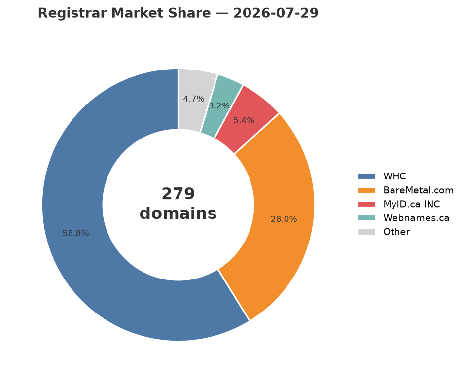

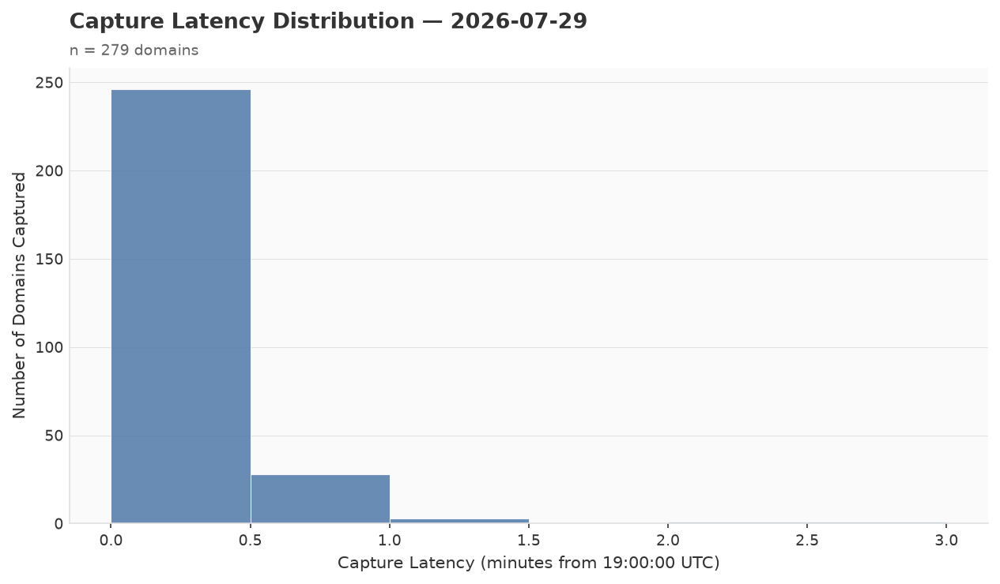

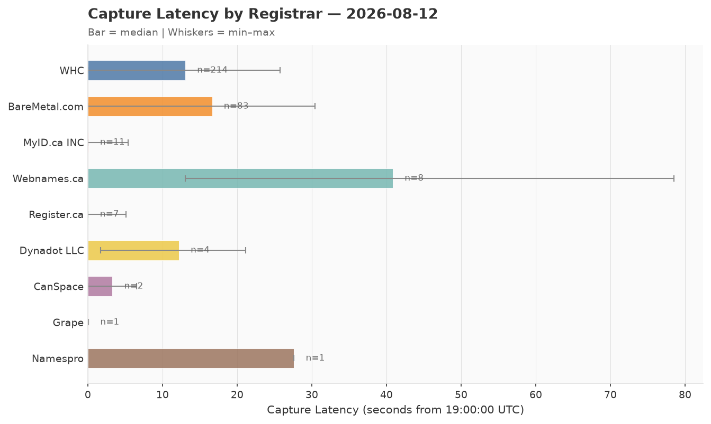

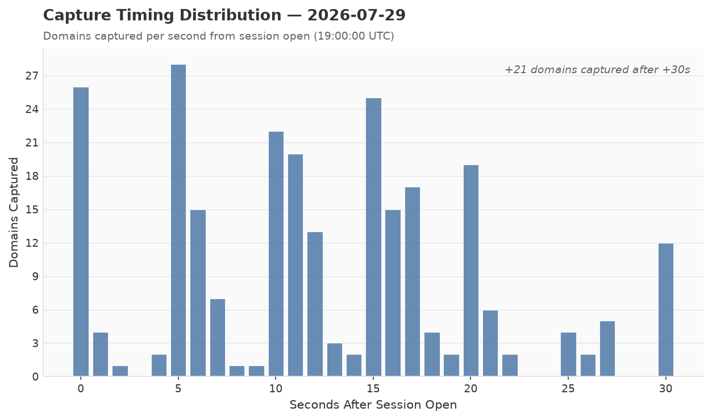

---

## Rolling Windows

### Last 4 Sessions

- **Sessions covered:** 4  (2026-08-26 → 2026-09-16)
- **Total domains registered:** 1,136
- **Avg domains/session:** 284.0
- **Unique registrars (ever active):** 12
- **Avg registrars/session:** 8.5
- **Market concentration HHI:** 3,974.5

| Registrar | Domains | Share | Sessions Active | Mean Latency (ms) |
|-----------|--------:|------:|----------------:|------------------:|
| WHC Online Solutions Inc. | 642 | 56.51% | 4 | 12055.4 |
| BareMetal.com inc | 298 | 26.23% | 4 | 20656.8 |
| Webnames.ca Inc. | 99 | 8.71% | 4 | 142258.8 |
| Register.ca Inc. | 34 | 2.99% | 4 | 2315.0 |
| MyID.ca INC. | 25 | 2.2% | 4 | 1018.7 |
| 8648255 CANADA LTD. O/A Dynadot LLC | 18 | 1.58% | 3 | 61367.4 |
| Grape Inc. | 9 | 0.79% | 2 | 2086.5 |
| DomainePlus.com (3612040 CANADA inc.) | 6 | 0.53% | 4 | 1391.1 |
| CanSpace Solutions Inc. | 2 | 0.18% | 2 | 4872.5 |
| PlanetHoster | 1 | 0.09% | 1 | 418 |
| Namespro Solutions Inc. | 1 | 0.09% | 1 | 113 |
| FastWebServer Internet Services Inc. | 1 | 0.09% | 1 | 5091 |

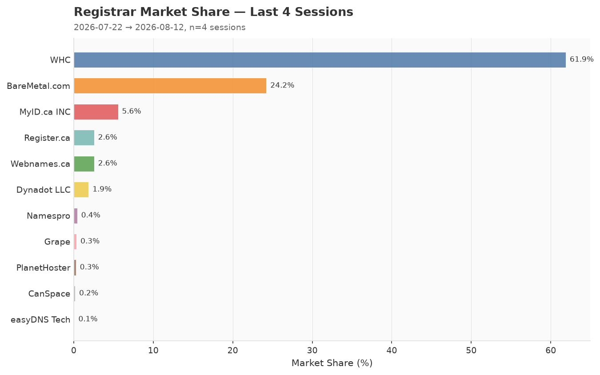

---

### Last ~6 Months (26 Weeks)

- **Sessions covered:** 22  (2026-04-15 → 2026-09-16)
- **Total domains registered:** 5,378
- **Avg domains/session:** 244.5
- **Unique registrars (ever active):** 13
- **Avg registrars/session:** 9
- **Market concentration HHI:** 4,342.0

| Registrar | Domains | Share | Sessions Active | Mean Latency (ms) |
|-----------|--------:|------:|----------------:|------------------:|
| WHC Online Solutions Inc. | 3,286 | 61.1% | 22 | 10735.8 |
| BareMetal.com inc | 1,273 | 23.67% | 22 | 14232.6 |
| MyID.ca INC. | 246 | 4.57% | 21 | 6494.2 |
| Webnames.ca Inc. | 228 | 4.24% | 22 | 91334.1 |
| Register.ca Inc. | 133 | 2.47% | 19 | 2842.6 |
| 8648255 CANADA LTD. O/A Dynadot LLC | 82 | 1.52% | 19 | 40044.0 |
| Grape Inc. | 42 | 0.78% | 16 | 2084.5 |
| DomainePlus.com (3612040 CANADA inc.) | 28 | 0.52% | 16 | 3511.3 |
| Namespro Solutions Inc. | 21 | 0.39% | 12 | 25137.3 |
| PlanetHoster | 18 | 0.33% | 12 | 1286.9 |
| easyDNS Technologies Inc. | 11 | 0.2% | 8 | 10928.4 |
| CanSpace Solutions Inc. | 7 | 0.13% | 6 | 82207.7 |
| FastWebServer Internet Services Inc. | 3 | 0.06% | 3 | 3716.7 |

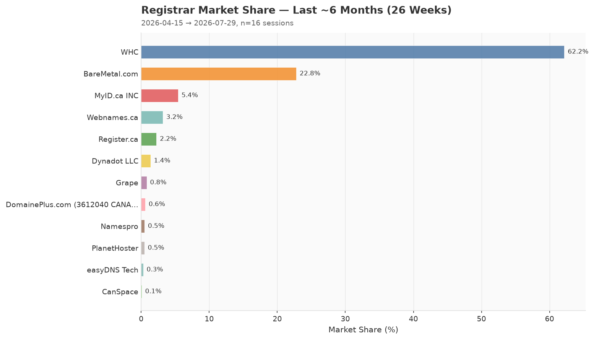

---

### Last 52 Weeks

- **Sessions covered:** 22  (2026-04-15 → 2026-09-16)
- **Total domains registered:** 5,378
- **Avg domains/session:** 244.5
- **Unique registrars (ever active):** 13
- **Avg registrars/session:** 9
- **Market concentration HHI:** 4,342.0

| Registrar | Domains | Share | Sessions Active | Mean Latency (ms) |
|-----------|--------:|------:|----------------:|------------------:|
| WHC Online Solutions Inc. | 3,286 | 61.1% | 22 | 10735.8 |
| BareMetal.com inc | 1,273 | 23.67% | 22 | 14232.6 |
| MyID.ca INC. | 246 | 4.57% | 21 | 6494.2 |
| Webnames.ca Inc. | 228 | 4.24% | 22 | 91334.1 |
| Register.ca Inc. | 133 | 2.47% | 19 | 2842.6 |
| 8648255 CANADA LTD. O/A Dynadot LLC | 82 | 1.52% | 19 | 40044.0 |
| Grape Inc. | 42 | 0.78% | 16 | 2084.5 |
| DomainePlus.com (3612040 CANADA inc.) | 28 | 0.52% | 16 | 3511.3 |
| Namespro Solutions Inc. | 21 | 0.39% | 12 | 25137.3 |
| PlanetHoster | 18 | 0.33% | 12 | 1286.9 |
| easyDNS Technologies Inc. | 11 | 0.2% | 8 | 10928.4 |
| CanSpace Solutions Inc. | 7 | 0.13% | 6 | 82207.7 |
| FastWebServer Internet Services Inc. | 3 | 0.06% | 3 | 3716.7 |

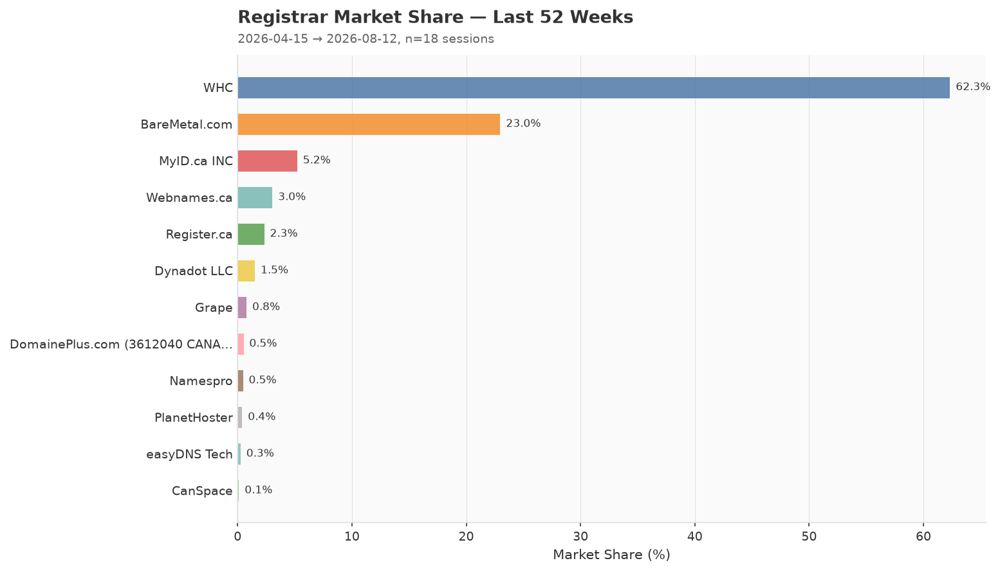

---

## All Time

- **Sessions covered:** 22  (2026-04-15 → 2026-09-16)
- **Total domains registered:** 5,378
- **Avg domains/session:** 244.5
- **Unique registrars (ever active):** 13
- **Avg registrars/session:** 9
- **Market concentration HHI:** 4,342.0

| Registrar | Domains | Share | Sessions Active | Mean Latency (ms) |
|-----------|--------:|------:|----------------:|------------------:|
| WHC Online Solutions Inc. | 3,286 | 61.1% | 22 | 10735.8 |
| BareMetal.com inc | 1,273 | 23.67% | 22 | 14232.6 |
| MyID.ca INC. | 246 | 4.57% | 21 | 6494.2 |
| Webnames.ca Inc. | 228 | 4.24% | 22 | 91334.1 |
| Register.ca Inc. | 133 | 2.47% | 19 | 2842.6 |
| 8648255 CANADA LTD. O/A Dynadot LLC | 82 | 1.52% | 19 | 40044.0 |
| Grape Inc. | 42 | 0.78% | 16 | 2084.5 |
| DomainePlus.com (3612040 CANADA inc.) | 28 | 0.52% | 16 | 3511.3 |
| Namespro Solutions Inc. | 21 | 0.39% | 12 | 25137.3 |
| PlanetHoster | 18 | 0.33% | 12 | 1286.9 |
| easyDNS Technologies Inc. | 11 | 0.2% | 8 | 10928.4 |
| CanSpace Solutions Inc. | 7 | 0.13% | 6 | 82207.7 |
| FastWebServer Internet Services Inc. | 3 | 0.06% | 3 | 3716.7 |

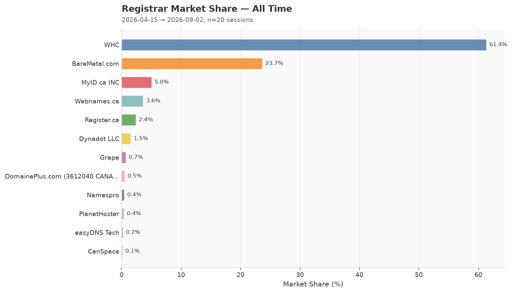

---

## Trends

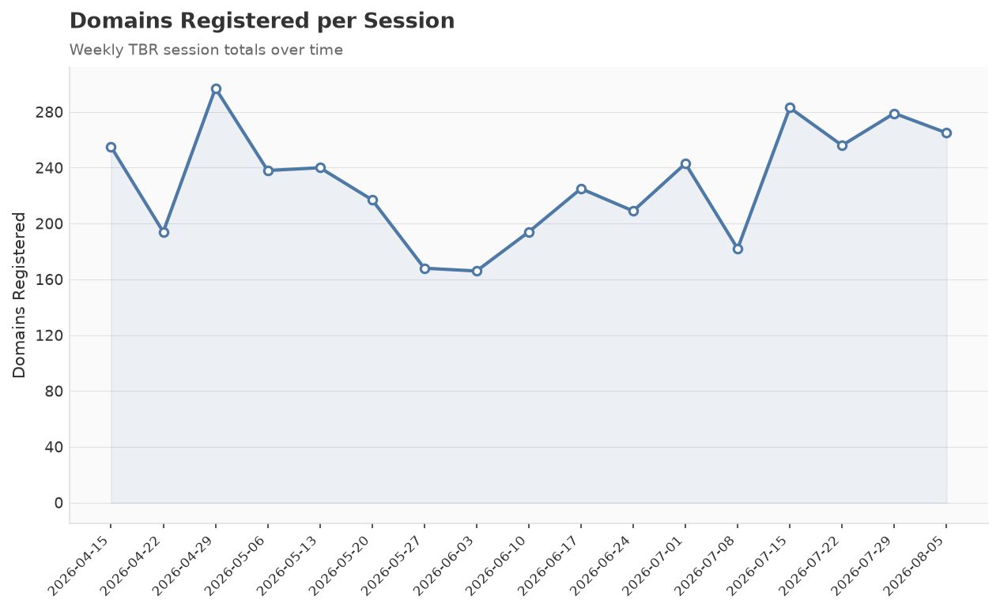

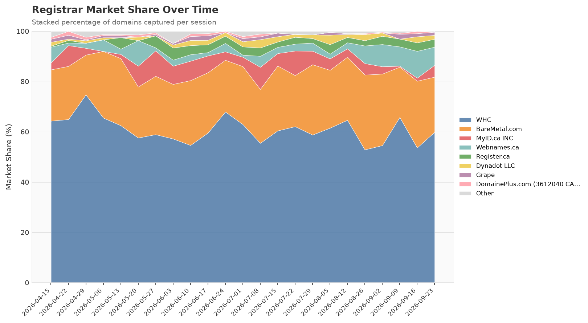

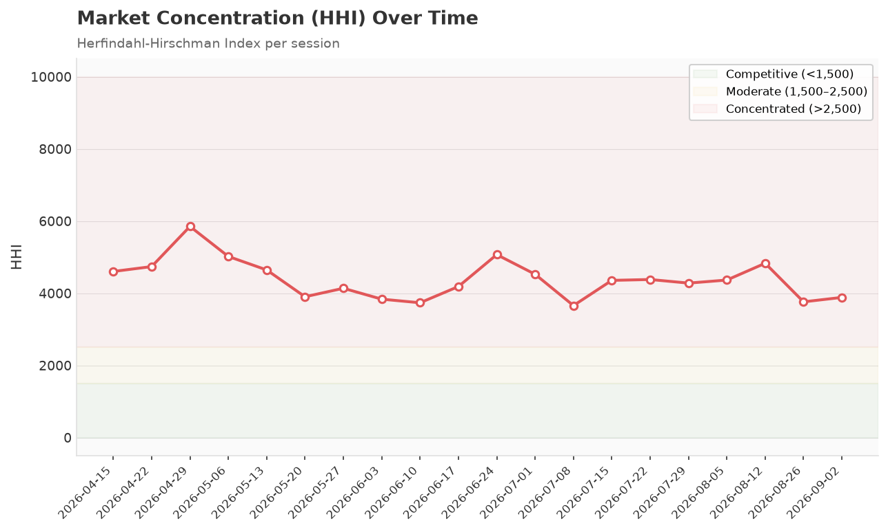

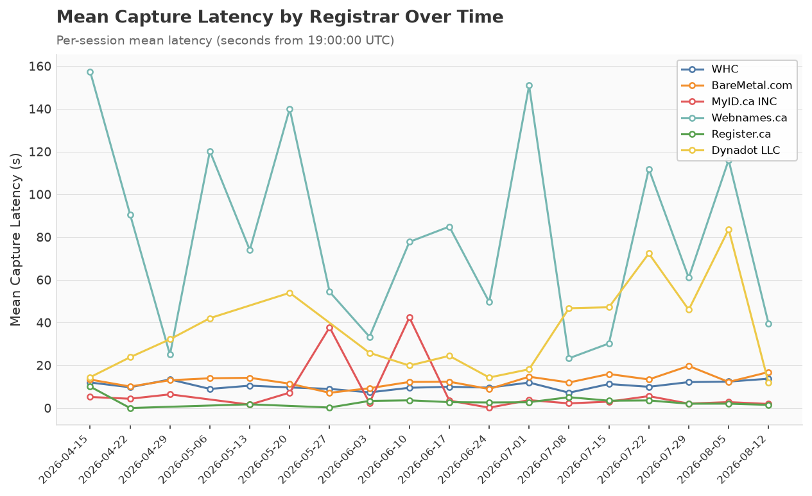

---

## By Year

### 2026

- **Sessions covered:** 22  (2026-04-15 → 2026-09-16)
- **Total domains registered:** 5,378
- **Avg domains/session:** 244.5
- **Unique registrars (ever active):** 13
- **Avg registrars/session:** 9
- **Market concentration HHI:** 4,342.0

| Registrar | Domains | Share | Sessions Active | Mean Latency (ms) |
|-----------|--------:|------:|----------------:|------------------:|
| WHC Online Solutions Inc. | 3,286 | 61.1% | 22 | 10735.8 |
| BareMetal.com inc | 1,273 | 23.67% | 22 | 14232.6 |
| MyID.ca INC. | 246 | 4.57% | 21 | 6494.2 |
| Webnames.ca Inc. | 228 | 4.24% | 22 | 91334.1 |
| Register.ca Inc. | 133 | 2.47% | 19 | 2842.6 |
| 8648255 CANADA LTD. O/A Dynadot LLC | 82 | 1.52% | 19 | 40044.0 |
| Grape Inc. | 42 | 0.78% | 16 | 2084.5 |
| DomainePlus.com (3612040 CANADA inc.) | 28 | 0.52% | 16 | 3511.3 |
| Namespro Solutions Inc. | 21 | 0.39% | 12 | 25137.3 |
| PlanetHoster | 18 | 0.33% | 12 | 1286.9 |
| easyDNS Technologies Inc. | 11 | 0.2% | 8 | 10928.4 |
| CanSpace Solutions Inc. | 7 | 0.13% | 6 | 82207.7 |
| FastWebServer Internet Services Inc. | 3 | 0.06% | 3 | 3716.7 |

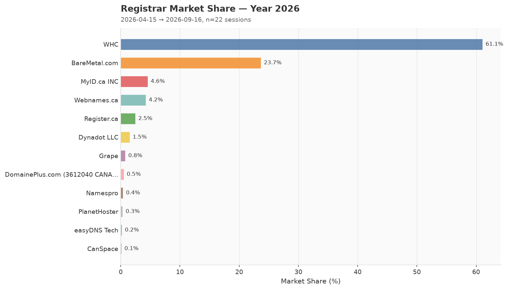

---

## By Month

#### 2026-04

- **Sessions covered:** 3  (2026-04-15 → 2026-04-29)
- **Total domains registered:** 746
- **Avg domains/session:** 248.7
- **Unique registrars (ever active):** 12
- **Avg registrars/session:** 10
- **Market concentration HHI:** 5,094.3

| Registrar | Domains | Share | Sessions Active | Mean Latency (ms) |
|-----------|--------:|------:|----------------:|------------------:|
| WHC Online Solutions Inc. | 512 | 68.63% | 3 | 11691.0 |
| BareMetal.com inc | 140 | 18.77% | 3 | 12138.8 |
| MyID.ca INC. | 31 | 4.16% | 3 | 5312.3 |
| Webnames.ca Inc. | 24 | 3.22% | 3 | 91027.8 |
| 8648255 CANADA LTD. O/A Dynadot LLC | 8 | 1.07% | 3 | 23467.1 |
| DomainePlus.com (3612040 CANADA inc.) | 8 | 1.07% | 3 | 5592 |
| Grape Inc. | 7 | 0.94% | 3 | 1755.4 |
| Namespro Solutions Inc. | 5 | 0.67% | 2 | 21235.8 |
| PlanetHoster | 4 | 0.54% | 2 | 2473.2 |
| easyDNS Technologies Inc. | 3 | 0.4% | 2 | 9532.5 |
| Register.ca Inc. | 3 | 0.4% | 2 | 5020.8 |
| CanSpace Solutions Inc. | 1 | 0.13% | 1 | 472283 |

#### 2026-05

- **Sessions covered:** 4  (2026-05-06 → 2026-05-27)
- **Total domains registered:** 863
- **Avg domains/session:** 215.8
- **Unique registrars (ever active):** 12
- **Avg registrars/session:** 8.2
- **Market concentration HHI:** 4,411.2

| Registrar | Domains | Share | Sessions Active | Mean Latency (ms) |
|-----------|--------:|------:|----------------:|------------------:|
| WHC Online Solutions Inc. | 530 | 61.41% | 4 | 9509.0 |
| BareMetal.com inc | 210 | 24.33% | 4 | 11662.0 |
| Webnames.ca Inc. | 40 | 4.63% | 4 | 97153.4 |
| MyID.ca INC. | 39 | 4.52% | 3 | 15531.4 |
| Register.ca Inc. | 19 | 2.2% | 2 | 999.5 |
| Grape Inc. | 5 | 0.58% | 3 | 49.7 |
| 8648255 CANADA LTD. O/A Dynadot LLC | 5 | 0.58% | 2 | 47995.1 |
| DomainePlus.com (3612040 CANADA inc.) | 5 | 0.58% | 4 | 735.9 |
| Namespro Solutions Inc. | 3 | 0.35% | 2 | 17200.2 |
| PlanetHoster | 3 | 0.35% | 2 | 2718.8 |
| easyDNS Technologies Inc. | 3 | 0.35% | 2 | 12175.8 |
| CanSpace Solutions Inc. | 1 | 0.12% | 1 | 7370 |

#### 2026-06

- **Sessions covered:** 4  (2026-06-03 → 2026-06-24)
- **Total domains registered:** 794
- **Avg domains/session:** 198.5
- **Unique registrars (ever active):** 11
- **Avg registrars/session:** 8.8
- **Market concentration HHI:** 4,202.1

| Registrar | Domains | Share | Sessions Active | Mean Latency (ms) |
|-----------|--------:|------:|----------------:|------------------:|
| WHC Online Solutions Inc. | 477 | 60.08% | 4 | 9082.6 |
| BareMetal.com inc | 183 | 23.05% | 4 | 10680.8 |
| MyID.ca INC. | 49 | 6.17% | 4 | 12134.8 |
| Register.ca Inc. | 28 | 3.53% | 4 | 3083.2 |
| Webnames.ca Inc. | 19 | 2.39% | 4 | 61415.4 |
| 8648255 CANADA LTD. O/A Dynadot LLC | 13 | 1.64% | 4 | 21115.8 |
| Grape Inc. | 8 | 1.01% | 3 | 1671.7 |
| Namespro Solutions Inc. | 6 | 0.76% | 2 | 21410.8 |
| DomainePlus.com (3612040 CANADA inc.) | 5 | 0.63% | 3 | 4468.5 |
| PlanetHoster | 4 | 0.5% | 2 | 571.8 |
| easyDNS Technologies Inc. | 2 | 0.25% | 1 | 30047.5 |

#### 2026-07

- **Sessions covered:** 5  (2026-07-01 → 2026-07-29)
- **Total domains registered:** 1,243
- **Avg domains/session:** 248.6
- **Unique registrars (ever active):** 13
- **Avg registrars/session:** 9.8
- **Market concentration HHI:** 4,255.0

| Registrar | Domains | Share | Sessions Active | Mean Latency (ms) |
|-----------|--------:|------:|----------------:|------------------:|
| WHC Online Solutions Inc. | 748 | 60.18% | 5 | 10484.8 |
| BareMetal.com inc | 298 | 23.97% | 5 | 15128.8 |
| MyID.ca INC. | 79 | 6.36% | 5 | 3309.2 |
| Webnames.ca Inc. | 33 | 2.65% | 5 | 75460.8 |
| Register.ca Inc. | 32 | 2.57% | 5 | 3368.1 |
| 8648255 CANADA LTD. O/A Dynadot LLC | 24 | 1.93% | 5 | 46077.7 |
| Grape Inc. | 9 | 0.72% | 3 | 2242.8 |
| PlanetHoster | 6 | 0.48% | 5 | 699.4 |
| DomainePlus.com (3612040 CANADA inc.) | 4 | 0.32% | 2 | 8745.8 |
| Namespro Solutions Inc. | 4 | 0.32% | 3 | 44709.7 |
| easyDNS Technologies Inc. | 3 | 0.24% | 3 | 4654.3 |
| FastWebServer Internet Services Inc. | 2 | 0.16% | 2 | 3029.5 |
| CanSpace Solutions Inc. | 1 | 0.08% | 1 | 549 |

#### 2026-08

- **Sessions covered:** 3  (2026-08-05 → 2026-08-26)
- **Total domains registered:** 838
- **Avg domains/session:** 279.3
- **Unique registrars (ever active):** 11
- **Avg registrars/session:** 8.7
- **Market concentration HHI:** 4,338.3

| Registrar | Domains | Share | Sessions Active | Mean Latency (ms) |
|-----------|--------:|------:|----------------:|------------------:|
| WHC Online Solutions Inc. | 505 | 60.26% | 3 | 11862.8 |
| BareMetal.com inc | 216 | 25.78% | 3 | 20684.8 |
| MyID.ca INC. | 34 | 4.06% | 3 | 1924.2 |
| Webnames.ca Inc. | 30 | 3.58% | 3 | 77406.9 |
| Register.ca Inc. | 22 | 2.63% | 3 | 1204.8 |
| 8648255 CANADA LTD. O/A Dynadot LLC | 20 | 2.39% | 3 | 46853.3 |
| Grape Inc. | 4 | 0.48% | 2 | 6010.5 |
| CanSpace Solutions Inc. | 3 | 0.36% | 2 | 2473 |
| Namespro Solutions Inc. | 2 | 0.24% | 2 | 23856 |
| DomainePlus.com (3612040 CANADA inc.) | 1 | 0.12% | 1 | 75 |
| PlanetHoster | 1 | 0.12% | 1 | 418 |

#### 2026-09

- **Sessions covered:** 3  (2026-09-02 → 2026-09-16)
- **Total domains registered:** 894
- **Avg domains/session:** 298.0
- **Unique registrars (ever active):** 11
- **Avg registrars/session:** 8.3
- **Market concentration HHI:** 4,044.4

| Registrar | Domains | Share | Sessions Active | Mean Latency (ms) |
|-----------|--------:|------:|----------------:|------------------:|
| WHC Online Solutions Inc. | 514 | 57.49% | 3 | 12912.3 |
| BareMetal.com inc | 226 | 25.28% | 3 | 16544.0 |
| Webnames.ca Inc. | 82 | 9.17% | 3 | 164155.3 |
| Register.ca Inc. | 29 | 3.24% | 3 | 3060.0 |
| MyID.ca INC. | 14 | 1.57% | 3 | 996.8 |
| 8648255 CANADA LTD. O/A Dynadot LLC | 12 | 1.34% | 2 | 69516.8 |
| Grape Inc. | 9 | 1.01% | 2 | 2086.5 |
| DomainePlus.com (3612040 CANADA inc.) | 5 | 0.56% | 3 | 1829.8 |
| Namespro Solutions Inc. | 1 | 0.11% | 1 | 113 |
| FastWebServer Internet Services Inc. | 1 | 0.11% | 1 | 5091 |
| CanSpace Solutions Inc. | 1 | 0.11% | 1 | 8098 |

---

## Data & Files

| Path | Description |
|------|-------------|
| `data/YYYY/MM/DD.json` | Raw API response for each session |
| `tally.json` | Machine-readable aggregate statistics |
| `charts/` | Auto-generated visualizations (PNG) |
| `README.md` | This file — auto-generated each week |

---

## Metrics Glossary

| Metric | Description |
|--------|-------------|
| **Market Share %** | Percentage of session domains captured by a registrar |
| **HHI (Herfindahl-Hirschman Index)** | Market concentration; 10,000 = monopoly, <1,500 = competitive |
| **Capture Latency (ms)** | Milliseconds from session open (19:00:00.000 UTC) to domain registration timestamp |
| **Session Duration (ms)** | Time elapsed between the first and last domain captured in a session |
| **P95 Latency** | 95th-percentile capture latency — 95% of captures happened at or below this value |
| **StdDev Latency** | Standard deviation of capture latencies; lower = more consistent timing |
| **Session Presence %** | Share of sessions in which a registrar captured at least one domain |
| **Mean of Means Latency** | Average of per-session mean latencies across multiple sessions |
| **Timing Distribution** | Histogram of domain captures bucketed by second offset from session open |
| **Registration Rate %** | Fraction of released domains that were actually registered in the session |
