# CIRA TBR Tracker

> Automated archive and analytics for CIRA **To-Be-Released (TBR)** `.CA` domain
> drop sessions. Updated every **Wednesday ≈ 19:30 UTC** via GitHub Actions.

**Last updated:** 2026-09-30 &nbsp;|&nbsp; **Total sessions tracked:** 24

---

## What is TBR?

CIRA releases expired `.CA` domains every **Wednesday at 19:00 UTC** via a
first-come, first-served process. Whichever registrar submits a registration
request first wins the domain (one connection, one request per 5 s per registrar).

Capture latency is measured from the official session open at **19:00:00.000 UTC**.

---

## Last Session

- **Date:** 2026-09-30
- **Domains released:** 350
- **Domains registered:** 350
- **Registration rate:** 100.0%
- **Unique registrars:** 8
- **Session duration:** 335,684 ms
- **Market concentration (HHI):** 3,967.2

**Capture latency across all registrars:**
- Min: 8 ms | Median: 15640 ms | Mean: 29396.4 ms | P95: 199992 ms | Max: 335692 ms

**Per-registrar latency breakdown:**

| Registrar | Domains | Min (ms) | Median (ms) | Mean (ms) | P95 (ms) | Max (ms) | StdDev (ms) |
|-----------|--------:|---------:|------------:|----------:|---------:|---------:|------------:|
| WHC Online Solutions Inc. | 198 | 27 | 13669 | 13335.9 | 22861 | 23731 | 6617.7 |
| BareMetal.com inc | 91 | 78 | 22922 | 21522.4 | 35676 | 36967 | 10738.6 |
| Webnames.ca Inc. | 26 | 19299 | 227621 | 212575.5 | 330675 | 335692 | 96614.5 |
| MyID.ca INC. | 16 | 35 | 4992 | 3984.4 | 11700 | 11700 | 3802.1 |
| Register.ca Inc. | 13 | 8 | 4994 | 3920.8 | 10626 | 10626 | 3094.1 |
| Grape Inc. | 3 | 5036 | 5061 | 5680 | 6943 | 6943 | 1093.9 |
| Namespro Solutions Inc. | 2 | 12636 | 15298 | 15298.5 | 17961 | 17961 | 3765.3 |
| PlanetHoster | 1 | 394 | 394 | 394 | 394 | 394 | 0 |

**Timing distribution (captures by second offset from 19:00:00 UTC):**

| Offset (s) | Domains Captured |
|-----------:|-----------------:|
| +0 | 27 |
| +1 | 2 |
| +2 | 9 |
| +4 | 6 |
| +5 | 26 |
| +6 | 9 |
| +7 | 18 |
| +8 | 10 |
| +9 | 3 |
| +10 | 14 |
| +11 | 6 |
| +12 | 17 |
| +13 | 14 |
| +14 | 5 |
| +15 | 12 |
| +16 | 6 |
| +17 | 23 |
| +18 | 12 |
| +19 | 8 |
| +20 | 15 |
| +21 | 8 |
| +22 | 24 |
| +23 | 9 |
| +25 | 3 |
| +26 | 3 |
| +27 | 9 |
| +30 | 6 |
| +31 | 2 |
| +32 | 10 |
| +33 | 1 |
| +34 | 1 |
| +35 | 6 |
| +36 | 2 |
| +49 | 1 |
| +54 | 1 |
| +99 | 1 |
| +119 | 1 |
| +164 | 1 |
| +184 | 1 |
| +199 | 1 |
| +205 | 1 |
| +215 | 1 |
| +220 | 1 |
| +225 | 1 |
| +230 | 1 |
| +245 | 1 |
| +255 | 1 |
| +260 | 1 |
| +265 | 1 |
| +270 | 1 |
| +285 | 1 |
| +295 | 1 |
| +315 | 1 |
| +320 | 1 |
| +325 | 1 |
| +330 | 1 |
| +335 | 1 |

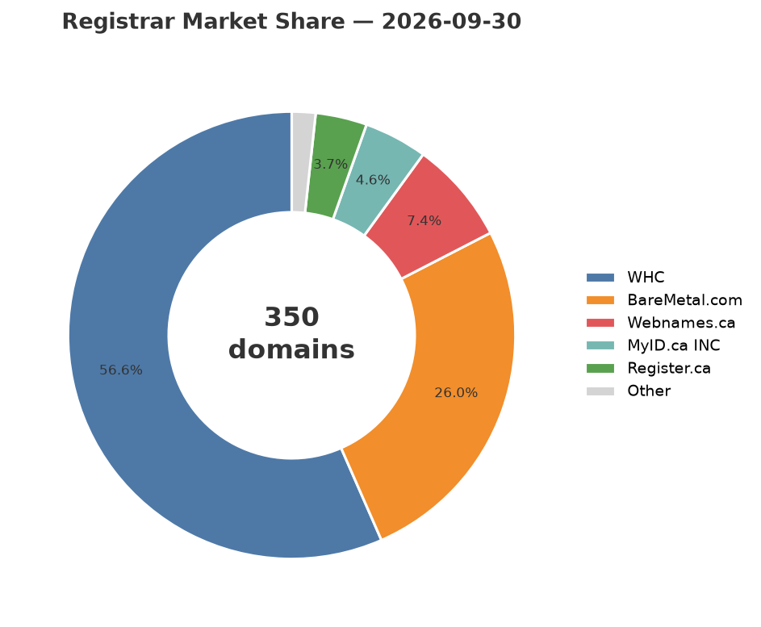

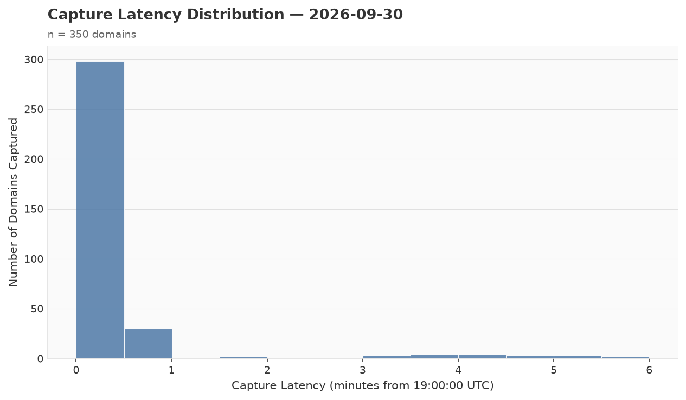

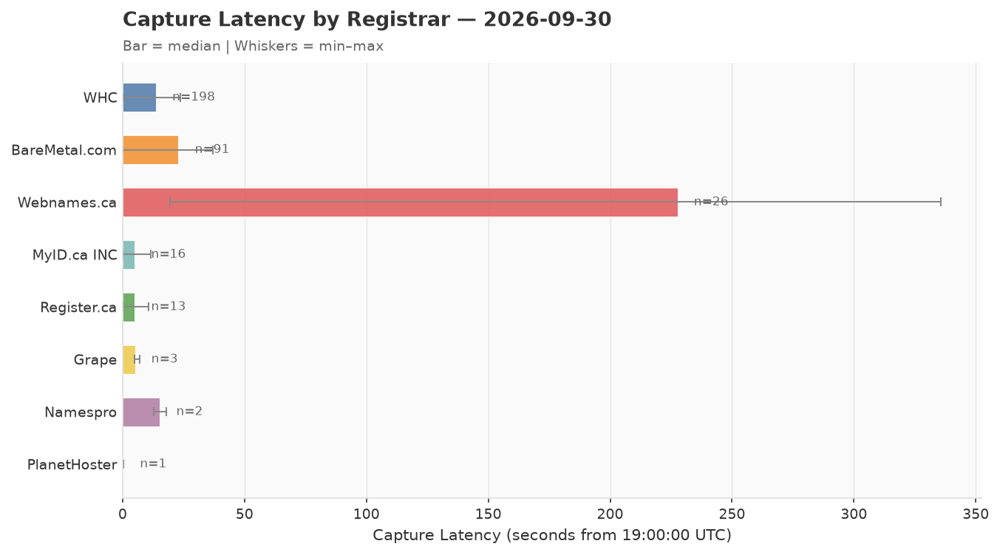

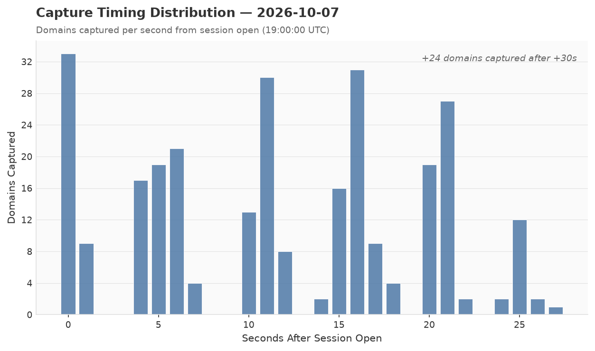

---

## Rolling Windows

### Last 4 Sessions

- **Sessions covered:** 4  (2026-09-09 → 2026-09-30)
- **Total domains registered:** 1,257
- **Avg domains/session:** 314.2
- **Unique registrars (ever active):** 12
- **Avg registrars/session:** 8.2
- **Market concentration HHI:** 4,088.4

| Registrar | Domains | Share | Sessions Active | Mean Latency (ms) |
|-----------|--------:|------:|----------------:|------------------:|
| WHC Online Solutions Inc. | 736 | 58.55% | 4 | 13378.1 |
| BareMetal.com inc | 300 | 23.87% | 4 | 16961.0 |
| Webnames.ca Inc. | 104 | 8.27% | 4 | 199420.1 |
| Register.ca Inc. | 42 | 3.34% | 4 | 3026.9 |
| MyID.ca INC. | 36 | 2.86% | 4 | 1830.9 |
| Grape Inc. | 16 | 1.27% | 4 | 3589.0 |
| 8648255 CANADA LTD. O/A Dynadot LLC | 13 | 1.03% | 2 | 54580.1 |
| DomainePlus.com (3612040 CANADA inc.) | 4 | 0.32% | 2 | 2689.7 |
| CanSpace Solutions Inc. | 2 | 0.16% | 2 | 4273 |
| Namespro Solutions Inc. | 2 | 0.16% | 1 | 15298.5 |
| FastWebServer Internet Services Inc. | 1 | 0.08% | 1 | 5091 |
| PlanetHoster | 1 | 0.08% | 1 | 394 |

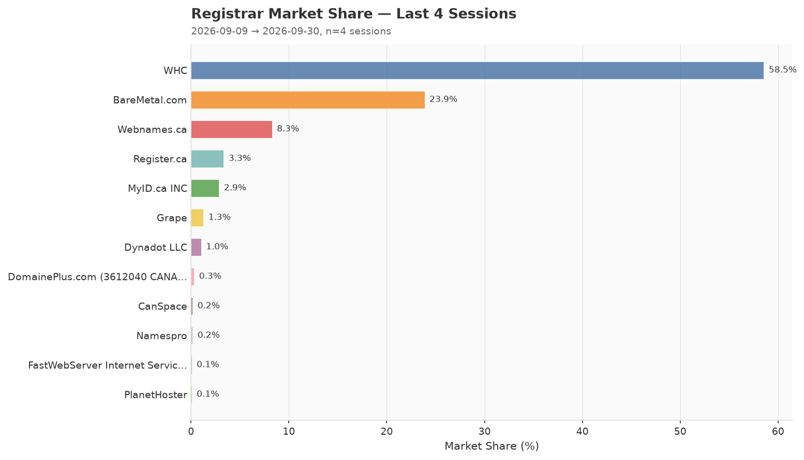

---

### Last ~6 Months (26 Weeks)

- **Sessions covered:** 24  (2026-04-15 → 2026-09-30)
- **Total domains registered:** 6,047
- **Avg domains/session:** 252.0
- **Unique registrars (ever active):** 13
- **Avg registrars/session:** 8.9
- **Market concentration HHI:** 4,307.0

| Registrar | Domains | Share | Sessions Active | Mean Latency (ms) |
|-----------|--------:|------:|----------------:|------------------:|
| WHC Online Solutions Inc. | 3,675 | 60.77% | 24 | 10986.1 |
| BareMetal.com inc | 1,434 | 23.71% | 24 | 14669.2 |
| Webnames.ca Inc. | 277 | 4.58% | 24 | 102681.8 |
| MyID.ca INC. | 277 | 4.58% | 23 | 6231.0 |
| Register.ca Inc. | 156 | 2.58% | 21 | 2931.9 |
| 8648255 CANADA LTD. O/A Dynadot LLC | 87 | 1.44% | 20 | 39625.4 |
| Grape Inc. | 49 | 0.81% | 18 | 2418.7 |
| DomainePlus.com (3612040 CANADA inc.) | 28 | 0.46% | 16 | 3511.3 |
| Namespro Solutions Inc. | 23 | 0.38% | 13 | 24380.5 |
| PlanetHoster | 19 | 0.31% | 13 | 1218.2 |
| easyDNS Technologies Inc. | 11 | 0.18% | 8 | 10928.4 |
| CanSpace Solutions Inc. | 8 | 0.13% | 7 | 70527.7 |
| FastWebServer Internet Services Inc. | 3 | 0.05% | 3 | 3716.7 |

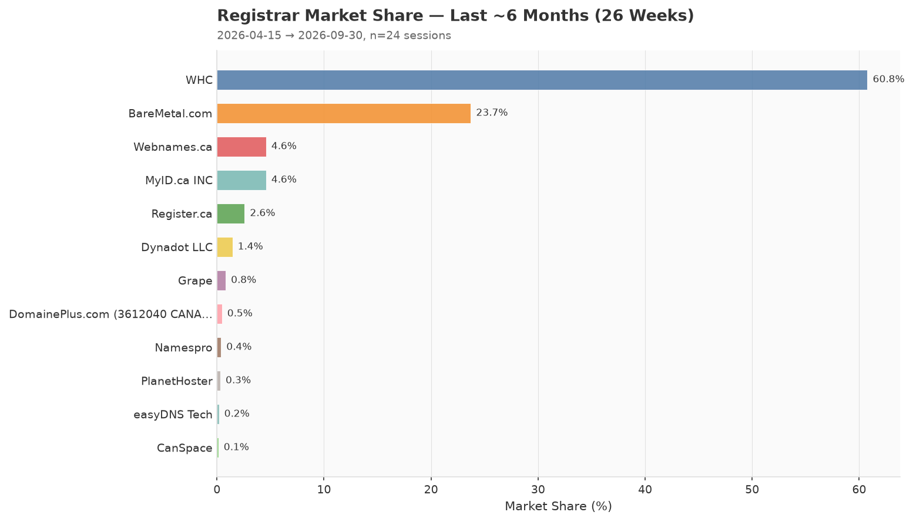

---

### Last 52 Weeks

- **Sessions covered:** 24  (2026-04-15 → 2026-09-30)
- **Total domains registered:** 6,047
- **Avg domains/session:** 252.0
- **Unique registrars (ever active):** 13
- **Avg registrars/session:** 8.9
- **Market concentration HHI:** 4,307.0

| Registrar | Domains | Share | Sessions Active | Mean Latency (ms) |
|-----------|--------:|------:|----------------:|------------------:|
| WHC Online Solutions Inc. | 3,675 | 60.77% | 24 | 10986.1 |
| BareMetal.com inc | 1,434 | 23.71% | 24 | 14669.2 |
| Webnames.ca Inc. | 277 | 4.58% | 24 | 102681.8 |
| MyID.ca INC. | 277 | 4.58% | 23 | 6231.0 |
| Register.ca Inc. | 156 | 2.58% | 21 | 2931.9 |
| 8648255 CANADA LTD. O/A Dynadot LLC | 87 | 1.44% | 20 | 39625.4 |
| Grape Inc. | 49 | 0.81% | 18 | 2418.7 |
| DomainePlus.com (3612040 CANADA inc.) | 28 | 0.46% | 16 | 3511.3 |
| Namespro Solutions Inc. | 23 | 0.38% | 13 | 24380.5 |
| PlanetHoster | 19 | 0.31% | 13 | 1218.2 |
| easyDNS Technologies Inc. | 11 | 0.18% | 8 | 10928.4 |
| CanSpace Solutions Inc. | 8 | 0.13% | 7 | 70527.7 |
| FastWebServer Internet Services Inc. | 3 | 0.05% | 3 | 3716.7 |

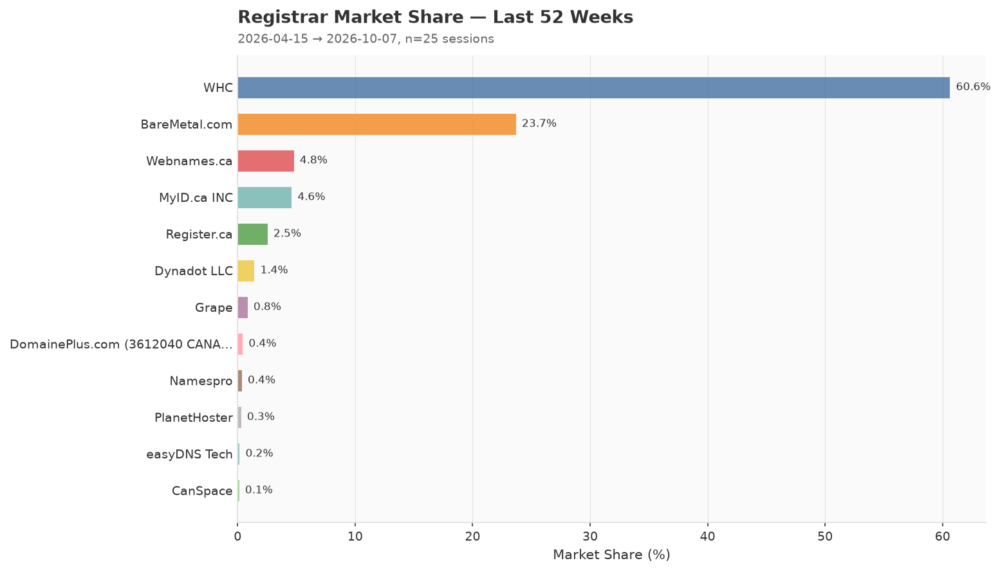

---

## All Time

- **Sessions covered:** 24  (2026-04-15 → 2026-09-30)
- **Total domains registered:** 6,047
- **Avg domains/session:** 252.0
- **Unique registrars (ever active):** 13
- **Avg registrars/session:** 8.9
- **Market concentration HHI:** 4,307.0

| Registrar | Domains | Share | Sessions Active | Mean Latency (ms) |
|-----------|--------:|------:|----------------:|------------------:|
| WHC Online Solutions Inc. | 3,675 | 60.77% | 24 | 10986.1 |
| BareMetal.com inc | 1,434 | 23.71% | 24 | 14669.2 |
| Webnames.ca Inc. | 277 | 4.58% | 24 | 102681.8 |
| MyID.ca INC. | 277 | 4.58% | 23 | 6231.0 |
| Register.ca Inc. | 156 | 2.58% | 21 | 2931.9 |
| 8648255 CANADA LTD. O/A Dynadot LLC | 87 | 1.44% | 20 | 39625.4 |
| Grape Inc. | 49 | 0.81% | 18 | 2418.7 |
| DomainePlus.com (3612040 CANADA inc.) | 28 | 0.46% | 16 | 3511.3 |
| Namespro Solutions Inc. | 23 | 0.38% | 13 | 24380.5 |
| PlanetHoster | 19 | 0.31% | 13 | 1218.2 |
| easyDNS Technologies Inc. | 11 | 0.18% | 8 | 10928.4 |
| CanSpace Solutions Inc. | 8 | 0.13% | 7 | 70527.7 |
| FastWebServer Internet Services Inc. | 3 | 0.05% | 3 | 3716.7 |

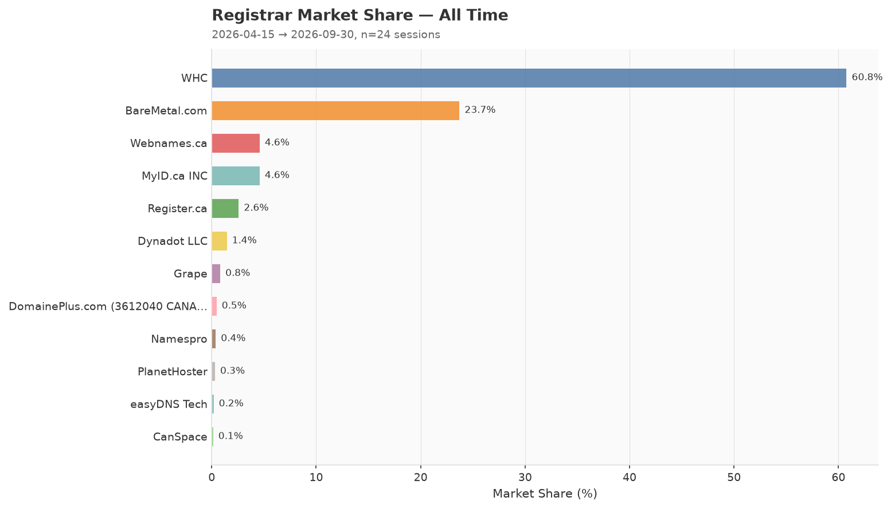

---

## Trends

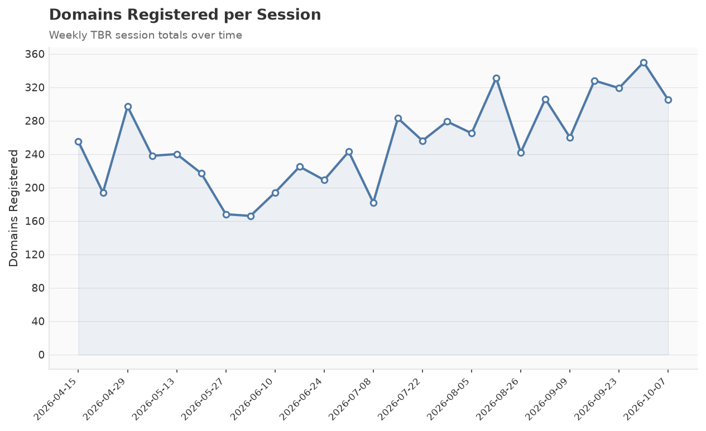

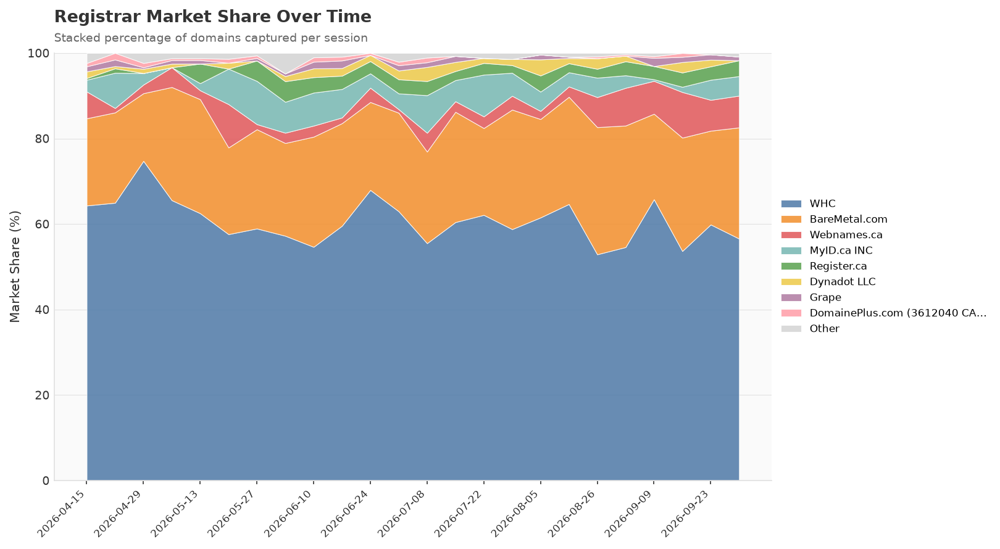

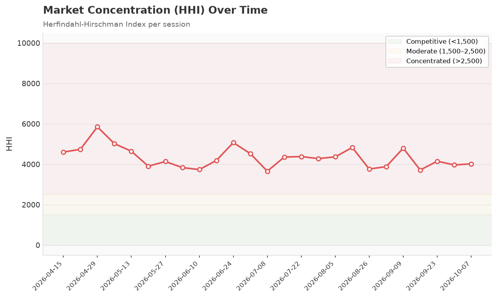

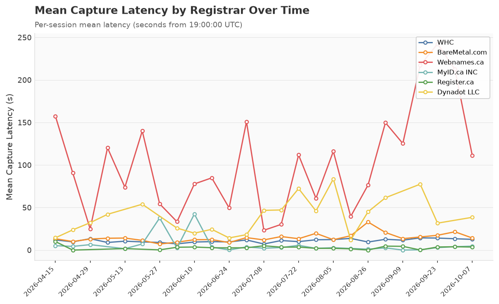

---

## By Year

### 2026

- **Sessions covered:** 24  (2026-04-15 → 2026-09-30)
- **Total domains registered:** 6,047
- **Avg domains/session:** 252.0
- **Unique registrars (ever active):** 13
- **Avg registrars/session:** 8.9
- **Market concentration HHI:** 4,307.0

| Registrar | Domains | Share | Sessions Active | Mean Latency (ms) |
|-----------|--------:|------:|----------------:|------------------:|
| WHC Online Solutions Inc. | 3,675 | 60.77% | 24 | 10986.1 |
| BareMetal.com inc | 1,434 | 23.71% | 24 | 14669.2 |
| Webnames.ca Inc. | 277 | 4.58% | 24 | 102681.8 |
| MyID.ca INC. | 277 | 4.58% | 23 | 6231.0 |
| Register.ca Inc. | 156 | 2.58% | 21 | 2931.9 |
| 8648255 CANADA LTD. O/A Dynadot LLC | 87 | 1.44% | 20 | 39625.4 |
| Grape Inc. | 49 | 0.81% | 18 | 2418.7 |
| DomainePlus.com (3612040 CANADA inc.) | 28 | 0.46% | 16 | 3511.3 |
| Namespro Solutions Inc. | 23 | 0.38% | 13 | 24380.5 |
| PlanetHoster | 19 | 0.31% | 13 | 1218.2 |
| easyDNS Technologies Inc. | 11 | 0.18% | 8 | 10928.4 |
| CanSpace Solutions Inc. | 8 | 0.13% | 7 | 70527.7 |
| FastWebServer Internet Services Inc. | 3 | 0.05% | 3 | 3716.7 |

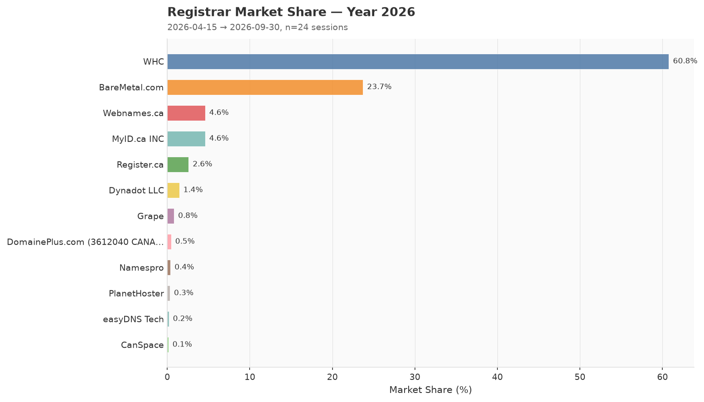

---

## By Month

#### 2026-04

- **Sessions covered:** 3  (2026-04-15 → 2026-04-29)
- **Total domains registered:** 746
- **Avg domains/session:** 248.7
- **Unique registrars (ever active):** 12
- **Avg registrars/session:** 10
- **Market concentration HHI:** 5,094.3

| Registrar | Domains | Share | Sessions Active | Mean Latency (ms) |
|-----------|--------:|------:|----------------:|------------------:|
| WHC Online Solutions Inc. | 512 | 68.63% | 3 | 11691.0 |
| BareMetal.com inc | 140 | 18.77% | 3 | 12138.8 |
| MyID.ca INC. | 31 | 4.16% | 3 | 5312.3 |
| Webnames.ca Inc. | 24 | 3.22% | 3 | 91027.8 |
| 8648255 CANADA LTD. O/A Dynadot LLC | 8 | 1.07% | 3 | 23467.1 |
| DomainePlus.com (3612040 CANADA inc.) | 8 | 1.07% | 3 | 5592 |
| Grape Inc. | 7 | 0.94% | 3 | 1755.4 |
| Namespro Solutions Inc. | 5 | 0.67% | 2 | 21235.8 |
| PlanetHoster | 4 | 0.54% | 2 | 2473.2 |
| easyDNS Technologies Inc. | 3 | 0.4% | 2 | 9532.5 |
| Register.ca Inc. | 3 | 0.4% | 2 | 5020.8 |
| CanSpace Solutions Inc. | 1 | 0.13% | 1 | 472283 |

#### 2026-05

- **Sessions covered:** 4  (2026-05-06 → 2026-05-27)
- **Total domains registered:** 863
- **Avg domains/session:** 215.8
- **Unique registrars (ever active):** 12
- **Avg registrars/session:** 8.2
- **Market concentration HHI:** 4,411.2

| Registrar | Domains | Share | Sessions Active | Mean Latency (ms) |
|-----------|--------:|------:|----------------:|------------------:|
| WHC Online Solutions Inc. | 530 | 61.41% | 4 | 9509.0 |
| BareMetal.com inc | 210 | 24.33% | 4 | 11662.0 |
| Webnames.ca Inc. | 40 | 4.63% | 4 | 97153.4 |
| MyID.ca INC. | 39 | 4.52% | 3 | 15531.4 |
| Register.ca Inc. | 19 | 2.2% | 2 | 999.5 |
| Grape Inc. | 5 | 0.58% | 3 | 49.7 |
| 8648255 CANADA LTD. O/A Dynadot LLC | 5 | 0.58% | 2 | 47995.1 |
| DomainePlus.com (3612040 CANADA inc.) | 5 | 0.58% | 4 | 735.9 |
| Namespro Solutions Inc. | 3 | 0.35% | 2 | 17200.2 |
| PlanetHoster | 3 | 0.35% | 2 | 2718.8 |
| easyDNS Technologies Inc. | 3 | 0.35% | 2 | 12175.8 |
| CanSpace Solutions Inc. | 1 | 0.12% | 1 | 7370 |

#### 2026-06

- **Sessions covered:** 4  (2026-06-03 → 2026-06-24)
- **Total domains registered:** 794
- **Avg domains/session:** 198.5
- **Unique registrars (ever active):** 11
- **Avg registrars/session:** 8.8
- **Market concentration HHI:** 4,202.1

| Registrar | Domains | Share | Sessions Active | Mean Latency (ms) |
|-----------|--------:|------:|----------------:|------------------:|
| WHC Online Solutions Inc. | 477 | 60.08% | 4 | 9082.6 |
| BareMetal.com inc | 183 | 23.05% | 4 | 10680.8 |
| MyID.ca INC. | 49 | 6.17% | 4 | 12134.8 |
| Register.ca Inc. | 28 | 3.53% | 4 | 3083.2 |
| Webnames.ca Inc. | 19 | 2.39% | 4 | 61415.4 |
| 8648255 CANADA LTD. O/A Dynadot LLC | 13 | 1.64% | 4 | 21115.8 |
| Grape Inc. | 8 | 1.01% | 3 | 1671.7 |
| Namespro Solutions Inc. | 6 | 0.76% | 2 | 21410.8 |
| DomainePlus.com (3612040 CANADA inc.) | 5 | 0.63% | 3 | 4468.5 |
| PlanetHoster | 4 | 0.5% | 2 | 571.8 |
| easyDNS Technologies Inc. | 2 | 0.25% | 1 | 30047.5 |

#### 2026-07

- **Sessions covered:** 5  (2026-07-01 → 2026-07-29)
- **Total domains registered:** 1,243
- **Avg domains/session:** 248.6
- **Unique registrars (ever active):** 13
- **Avg registrars/session:** 9.8
- **Market concentration HHI:** 4,255.0

| Registrar | Domains | Share | Sessions Active | Mean Latency (ms) |
|-----------|--------:|------:|----------------:|------------------:|
| WHC Online Solutions Inc. | 748 | 60.18% | 5 | 10484.8 |
| BareMetal.com inc | 298 | 23.97% | 5 | 15128.8 |
| MyID.ca INC. | 79 | 6.36% | 5 | 3309.2 |
| Webnames.ca Inc. | 33 | 2.65% | 5 | 75460.8 |
| Register.ca Inc. | 32 | 2.57% | 5 | 3368.1 |
| 8648255 CANADA LTD. O/A Dynadot LLC | 24 | 1.93% | 5 | 46077.7 |
| Grape Inc. | 9 | 0.72% | 3 | 2242.8 |
| PlanetHoster | 6 | 0.48% | 5 | 699.4 |
| DomainePlus.com (3612040 CANADA inc.) | 4 | 0.32% | 2 | 8745.8 |
| Namespro Solutions Inc. | 4 | 0.32% | 3 | 44709.7 |
| easyDNS Technologies Inc. | 3 | 0.24% | 3 | 4654.3 |
| FastWebServer Internet Services Inc. | 2 | 0.16% | 2 | 3029.5 |
| CanSpace Solutions Inc. | 1 | 0.08% | 1 | 549 |

#### 2026-08

- **Sessions covered:** 3  (2026-08-05 → 2026-08-26)
- **Total domains registered:** 838
- **Avg domains/session:** 279.3
- **Unique registrars (ever active):** 11
- **Avg registrars/session:** 8.7
- **Market concentration HHI:** 4,338.3

| Registrar | Domains | Share | Sessions Active | Mean Latency (ms) |
|-----------|--------:|------:|----------------:|------------------:|
| WHC Online Solutions Inc. | 505 | 60.26% | 3 | 11862.8 |
| BareMetal.com inc | 216 | 25.78% | 3 | 20684.8 |
| MyID.ca INC. | 34 | 4.06% | 3 | 1924.2 |
| Webnames.ca Inc. | 30 | 3.58% | 3 | 77406.9 |
| Register.ca Inc. | 22 | 2.63% | 3 | 1204.8 |
| 8648255 CANADA LTD. O/A Dynadot LLC | 20 | 2.39% | 3 | 46853.3 |
| Grape Inc. | 4 | 0.48% | 2 | 6010.5 |
| CanSpace Solutions Inc. | 3 | 0.36% | 2 | 2473 |
| Namespro Solutions Inc. | 2 | 0.24% | 2 | 23856 |
| DomainePlus.com (3612040 CANADA inc.) | 1 | 0.12% | 1 | 75 |
| PlanetHoster | 1 | 0.12% | 1 | 418 |

#### 2026-09

- **Sessions covered:** 5  (2026-09-02 → 2026-09-30)
- **Total domains registered:** 1,563
- **Avg domains/session:** 312.6
- **Unique registrars (ever active):** 12
- **Avg registrars/session:** 8.2
- **Market concentration HHI:** 4,042.4

| Registrar | Domains | Share | Sessions Active | Mean Latency (ms) |
|-----------|--------:|------:|----------------:|------------------:|
| WHC Online Solutions Inc. | 903 | 57.77% | 5 | 13243.2 |
| BareMetal.com inc | 387 | 24.76% | 5 | 17715.3 |
| Webnames.ca Inc. | 131 | 8.38% | 5 | 189495.8 |
| Register.ca Inc. | 52 | 3.33% | 5 | 3348.2 |
| MyID.ca INC. | 45 | 2.88% | 5 | 1985.1 |
| 8648255 CANADA LTD. O/A Dynadot LLC | 17 | 1.09% | 3 | 56901.7 |
| Grape Inc. | 16 | 1.02% | 4 | 3589.0 |
| DomainePlus.com (3612040 CANADA inc.) | 5 | 0.32% | 3 | 1829.8 |
| Namespro Solutions Inc. | 3 | 0.19% | 2 | 7705.8 |
| CanSpace Solutions Inc. | 2 | 0.13% | 2 | 4273 |
| FastWebServer Internet Services Inc. | 1 | 0.06% | 1 | 5091 |
| PlanetHoster | 1 | 0.06% | 1 | 394 |

---

## Data & Files

| Path | Description |
|------|-------------|
| `data/YYYY/MM/DD.json` | Raw API response for each session |
| `tally.json` | Machine-readable aggregate statistics |
| `charts/` | Auto-generated visualizations (PNG) |
| `README.md` | This file — auto-generated each week |

---

## Metrics Glossary

| Metric | Description |
|--------|-------------|
| **Market Share %** | Percentage of session domains captured by a registrar |
| **HHI (Herfindahl-Hirschman Index)** | Market concentration; 10,000 = monopoly, <1,500 = competitive |
| **Capture Latency (ms)** | Milliseconds from session open (19:00:00.000 UTC) to domain registration timestamp |
| **Session Duration (ms)** | Time elapsed between the first and last domain captured in a session |
| **P95 Latency** | 95th-percentile capture latency — 95% of captures happened at or below this value |
| **StdDev Latency** | Standard deviation of capture latencies; lower = more consistent timing |
| **Session Presence %** | Share of sessions in which a registrar captured at least one domain |
| **Mean of Means Latency** | Average of per-session mean latencies across multiple sessions |
| **Timing Distribution** | Histogram of domain captures bucketed by second offset from session open |
| **Registration Rate %** | Fraction of released domains that were actually registered in the session |
