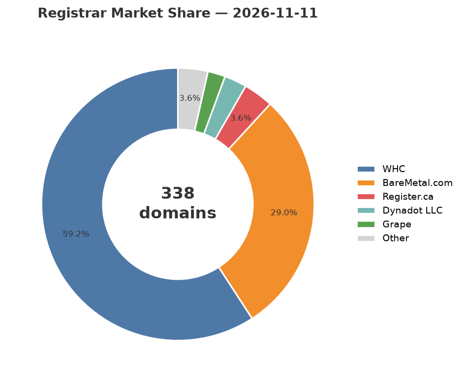
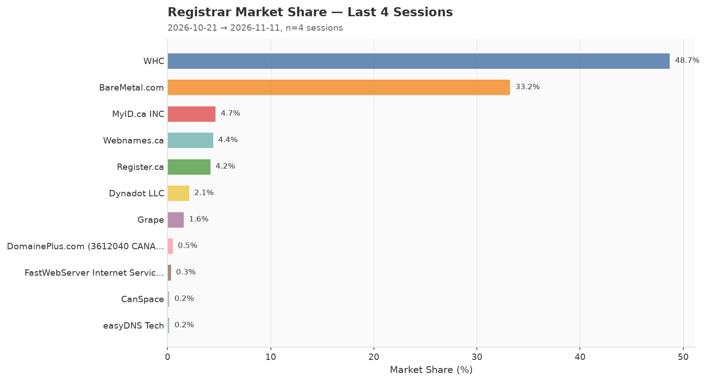
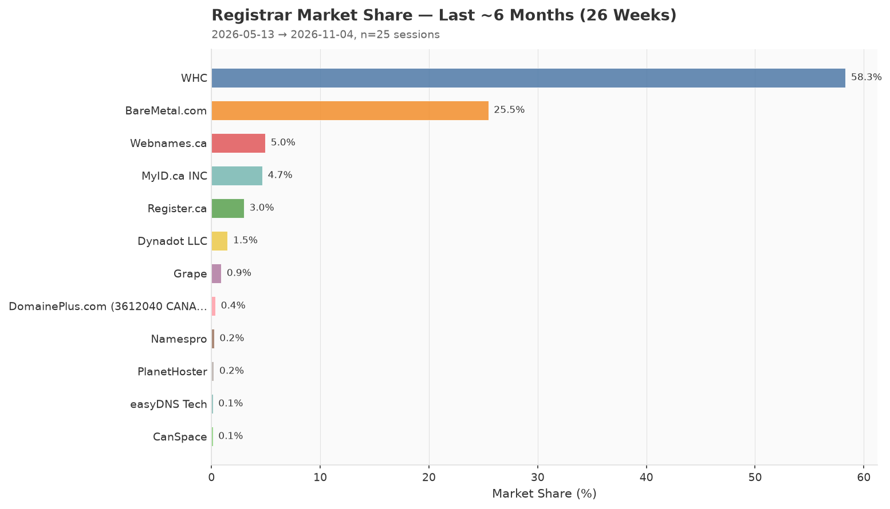
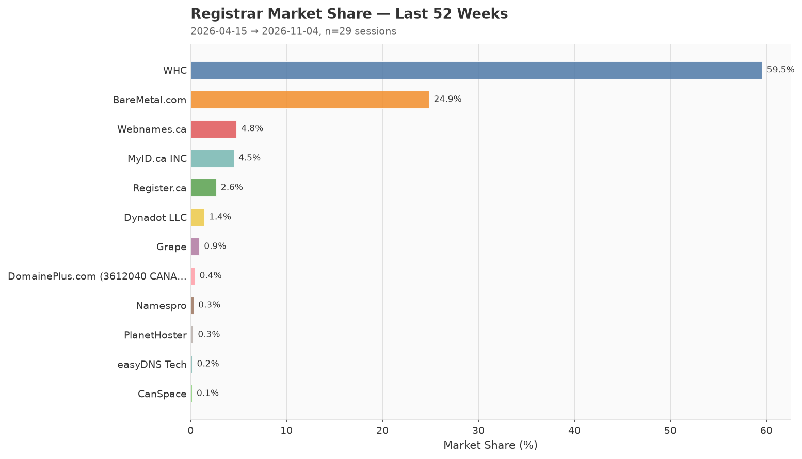
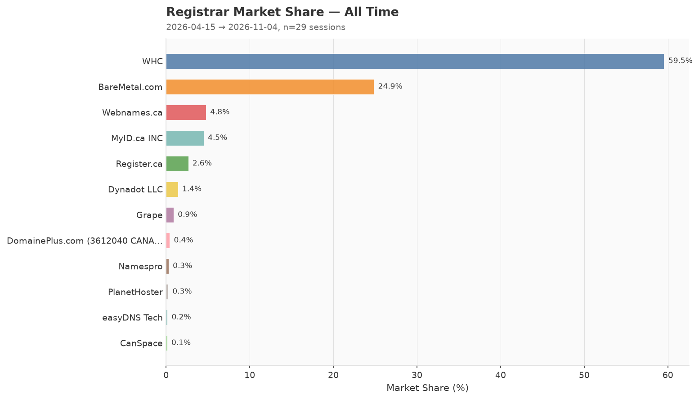
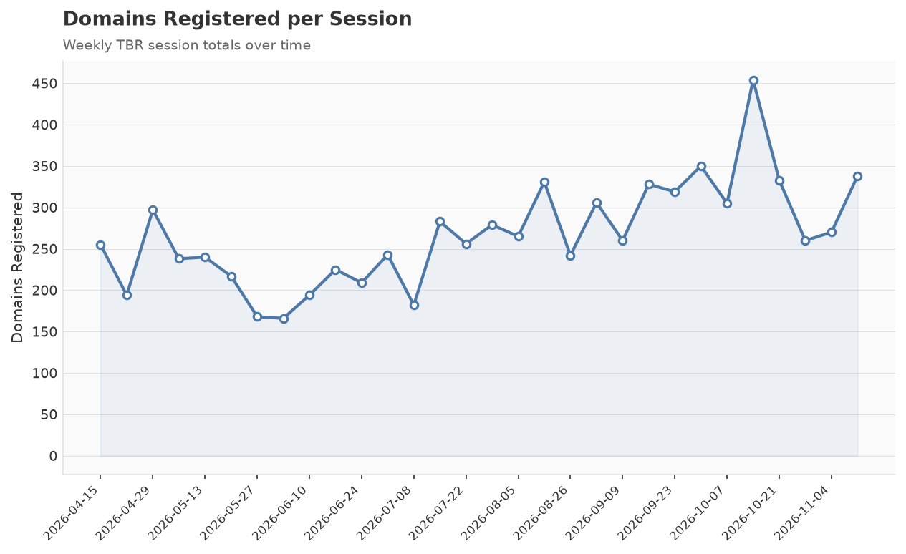
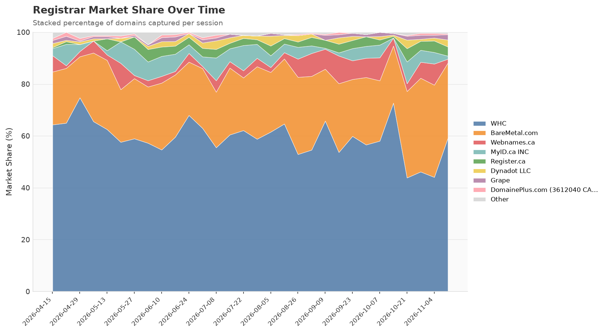
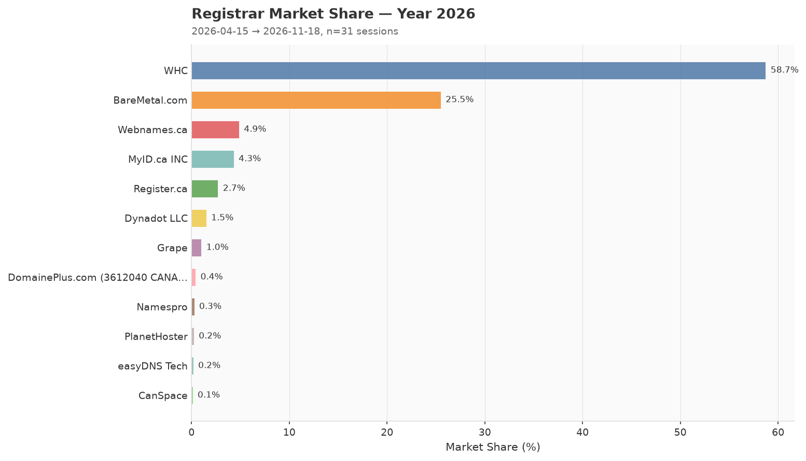

# CIRA TBR Tracker

> Automated archive and analytics for CIRA **To-Be-Released (TBR)** `.CA` domain
> drop sessions. Updated every **Wednesday ≈ 19:30 UTC** via GitHub Actions.

**Last updated:** 2026-11-05 &nbsp;|&nbsp; **Total sessions tracked:** 29

---

## What is TBR?

CIRA releases expired `.CA` domains every **Wednesday at 19:00 UTC** via a
first-come, first-served process. Whichever registrar submits a registration
request first wins the domain (one connection, one request per 5 s per registrar).

Capture latency is measured from the official session open at **19:00:00.000 UTC**.

---

## Last Session

- **Date:** 2026-11-04
- **Domains released:** 270
- **Domains registered:** 270
- **Registration rate:** 100.0%
- **Unique registrars:** 9
- **Session duration:** 517,539 ms
- **Market concentration (HHI):** 3,315.7

**Capture latency across all registrars:**
- Min: 19 ms | Median: 11359 ms | Mean: 19923.9 ms | P95: 60981 ms | Max: 517558 ms

**Per-registrar latency breakdown:**

| Registrar | Domains | Min (ms) | Median (ms) | Mean (ms) | P95 (ms) | Max (ms) | StdDev (ms) |
|-----------|--------:|---------:|------------:|----------:|---------:|---------:|------------:|
| WHC Online Solutions Inc. | 119 | 29 | 10699 | 9407.5 | 15867 | 16637 | 4726.2 |
| BareMetal.com inc | 96 | 19 | 15685 | 14595.7 | 26058 | 26644 | 7666.7 |
| Webnames.ca Inc. | 22 | 4905 | 108648 | 121833.5 | 216572 | 517558 | 112201.1 |
| MyID.ca INC. | 12 | 31 | 5031 | 5688.8 | 10698 | 10698 | 2683.2 |
| Register.ca Inc. | 12 | 32 | 5038 | 4198.8 | 9965 | 9965 | 2859.7 |
| Grape Inc. | 3 | 19 | 4999 | 5010.3 | 10013 | 10013 | 4997.0 |
| 8648255 CANADA LTD. O/A Dynadot LLC | 3 | 1339 | 13464 | 11375 | 19322 | 19322 | 9171.7 |
| DomainePlus.com (3612040 CANADA inc.) | 2 | 1601 | 4637 | 4637 | 7673 | 7673 | 4293.6 |
| easyDNS Technologies Inc. | 1 | 1359 | 1359 | 1359 | 1359 | 1359 | 0 |

**Timing distribution (captures by second offset from 19:00:00 UTC):**

| Offset (s) | Domains Captured |
|-----------:|-----------------:|
| +0 | 21 |
| +1 | 6 |
| +4 | 10 |
| +5 | 32 |
| +6 | 31 |
| +7 | 6 |
| +9 | 3 |
| +10 | 22 |
| +11 | 14 |
| +12 | 4 |
| +13 | 29 |
| +14 | 3 |
| +15 | 19 |
| +16 | 11 |
| +17 | 1 |
| +18 | 6 |
| +19 | 1 |
| +20 | 6 |
| +21 | 7 |
| +22 | 1 |
| +23 | 6 |
| +25 | 7 |
| +26 | 5 |
| +30 | 1 |
| +35 | 1 |
| +40 | 1 |
| +45 | 1 |
| +50 | 1 |
| +60 | 1 |
| +71 | 1 |
| +96 | 1 |
| +121 | 1 |
| +126 | 1 |
| +131 | 1 |
| +146 | 1 |
| +161 | 1 |
| +171 | 1 |
| +196 | 1 |
| +201 | 1 |
| +211 | 1 |
| +216 | 1 |
| +517 | 1 |

---

## Rolling Windows

### Last 4 Sessions

- **Sessions covered:** 4  (2026-10-14 → 2026-11-04)
- **Total domains registered:** 1,317
- **Avg domains/session:** 329.2
- **Unique registrars (ever active):** 12
- **Avg registrars/session:** 9
- **Market concentration HHI:** 3,925.5

| Registrar | Domains | Share | Sessions Active | Mean Latency (ms) |
|-----------|--------:|------:|----------------:|------------------:|
| WHC Online Solutions Inc. | 715 | 54.29% | 4 | 12658.8 |
| BareMetal.com inc | 401 | 30.45% | 4 | 13866.2 |
| Webnames.ca Inc. | 62 | 4.71% | 4 | 96359.1 |
| MyID.ca INC. | 52 | 3.95% | 3 | 80974.1 |
| Register.ca Inc. | 41 | 3.11% | 4 | 3532.7 |
| 8648255 CANADA LTD. O/A Dynadot LLC | 18 | 1.37% | 4 | 71967.6 |
| Grape Inc. | 15 | 1.14% | 4 | 3656.2 |
| DomainePlus.com (3612040 CANADA inc.) | 5 | 0.38% | 3 | 3212.5 |
| FastWebServer Internet Services Inc. | 4 | 0.3% | 3 | 2516.5 |
| CanSpace Solutions Inc. | 2 | 0.15% | 1 | 11312.5 |
| PlanetHoster | 1 | 0.08% | 1 | 500 |
| easyDNS Technologies Inc. | 1 | 0.08% | 1 | 1359 |

---

### Last ~6 Months (26 Weeks)

- **Sessions covered:** 25  (2026-05-13 → 2026-11-04)
- **Total domains registered:** 6,685
- **Avg domains/session:** 267.4
- **Unique registrars (ever active):** 13
- **Avg registrars/session:** 8.8
- **Market concentration HHI:** 4,108.6

| Registrar | Domains | Share | Sessions Active | Mean Latency (ms) |
|-----------|--------:|------:|----------------:|------------------:|
| WHC Online Solutions Inc. | 3,899 | 58.32% | 25 | 11315.7 |
| BareMetal.com inc | 1,703 | 25.47% | 25 | 14854.8 |
| Webnames.ca Inc. | 331 | 4.95% | 25 | 102707.2 |
| MyID.ca INC. | 313 | 4.68% | 24 | 15621.7 |
| Register.ca Inc. | 200 | 2.99% | 24 | 2885.5 |
| 8648255 CANADA LTD. O/A Dynadot LLC | 99 | 1.48% | 21 | 47927.0 |
| Grape Inc. | 60 | 0.9% | 19 | 2886.0 |
| DomainePlus.com (3612040 CANADA inc.) | 24 | 0.36% | 15 | 3202.4 |
| Namespro Solutions Inc. | 16 | 0.24% | 10 | 24679.6 |
| PlanetHoster | 15 | 0.22% | 11 | 995.5 |
| easyDNS Technologies Inc. | 9 | 0.13% | 7 | 9960.1 |
| CanSpace Solutions Inc. | 9 | 0.13% | 7 | 4674.8 |
| FastWebServer Internet Services Inc. | 7 | 0.1% | 6 | 3116.6 |

---

### Last 52 Weeks

- **Sessions covered:** 29  (2026-04-15 → 2026-11-04)
- **Total domains registered:** 7,669
- **Avg domains/session:** 264.4
- **Unique registrars (ever active):** 13
- **Avg registrars/session:** 8.9
- **Market concentration HHI:** 4,216.9

| Registrar | Domains | Share | Sessions Active | Mean Latency (ms) |
|-----------|--------:|------:|----------------:|------------------:|
| WHC Online Solutions Inc. | 4,567 | 59.55% | 29 | 11273.1 |
| BareMetal.com inc | 1,906 | 24.85% | 29 | 14542.1 |
| Webnames.ca Inc. | 366 | 4.77% | 29 | 102102.8 |
| MyID.ca INC. | 344 | 4.49% | 27 | 14476.2 |
| Register.ca Inc. | 203 | 2.65% | 26 | 3049.7 |
| 8648255 CANADA LTD. O/A Dynadot LLC | 109 | 1.42% | 25 | 44757.1 |
| Grape Inc. | 69 | 0.9% | 23 | 2616.4 |
| DomainePlus.com (3612040 CANADA inc.) | 33 | 0.43% | 19 | 3464.1 |
| Namespro Solutions Inc. | 23 | 0.3% | 13 | 24380.5 |
| PlanetHoster | 20 | 0.26% | 14 | 1166.9 |
| easyDNS Technologies Inc. | 12 | 0.16% | 9 | 9865.1 |
| CanSpace Solutions Inc. | 10 | 0.13% | 8 | 63125.8 |
| FastWebServer Internet Services Inc. | 7 | 0.09% | 6 | 3116.6 |

---

## All Time

- **Sessions covered:** 29  (2026-04-15 → 2026-11-04)
- **Total domains registered:** 7,669
- **Avg domains/session:** 264.4
- **Unique registrars (ever active):** 13
- **Avg registrars/session:** 8.9
- **Market concentration HHI:** 4,216.9

| Registrar | Domains | Share | Sessions Active | Mean Latency (ms) |
|-----------|--------:|------:|----------------:|------------------:|
| WHC Online Solutions Inc. | 4,567 | 59.55% | 29 | 11273.1 |
| BareMetal.com inc | 1,906 | 24.85% | 29 | 14542.1 |
| Webnames.ca Inc. | 366 | 4.77% | 29 | 102102.8 |
| MyID.ca INC. | 344 | 4.49% | 27 | 14476.2 |
| Register.ca Inc. | 203 | 2.65% | 26 | 3049.7 |
| 8648255 CANADA LTD. O/A Dynadot LLC | 109 | 1.42% | 25 | 44757.1 |
| Grape Inc. | 69 | 0.9% | 23 | 2616.4 |
| DomainePlus.com (3612040 CANADA inc.) | 33 | 0.43% | 19 | 3464.1 |
| Namespro Solutions Inc. | 23 | 0.3% | 13 | 24380.5 |
| PlanetHoster | 20 | 0.26% | 14 | 1166.9 |
| easyDNS Technologies Inc. | 12 | 0.16% | 9 | 9865.1 |
| CanSpace Solutions Inc. | 10 | 0.13% | 8 | 63125.8 |
| FastWebServer Internet Services Inc. | 7 | 0.09% | 6 | 3116.6 |

---

## Trends

---

## By Year

### 2026

- **Sessions covered:** 29  (2026-04-15 → 2026-11-04)
- **Total domains registered:** 7,669
- **Avg domains/session:** 264.4
- **Unique registrars (ever active):** 13
- **Avg registrars/session:** 8.9
- **Market concentration HHI:** 4,216.9

| Registrar | Domains | Share | Sessions Active | Mean Latency (ms) |
|-----------|--------:|------:|----------------:|------------------:|
| WHC Online Solutions Inc. | 4,567 | 59.55% | 29 | 11273.1 |
| BareMetal.com inc | 1,906 | 24.85% | 29 | 14542.1 |
| Webnames.ca Inc. | 366 | 4.77% | 29 | 102102.8 |
| MyID.ca INC. | 344 | 4.49% | 27 | 14476.2 |
| Register.ca Inc. | 203 | 2.65% | 26 | 3049.7 |
| 8648255 CANADA LTD. O/A Dynadot LLC | 109 | 1.42% | 25 | 44757.1 |
| Grape Inc. | 69 | 0.9% | 23 | 2616.4 |
| DomainePlus.com (3612040 CANADA inc.) | 33 | 0.43% | 19 | 3464.1 |
| Namespro Solutions Inc. | 23 | 0.3% | 13 | 24380.5 |
| PlanetHoster | 20 | 0.26% | 14 | 1166.9 |
| easyDNS Technologies Inc. | 12 | 0.16% | 9 | 9865.1 |
| CanSpace Solutions Inc. | 10 | 0.13% | 8 | 63125.8 |
| FastWebServer Internet Services Inc. | 7 | 0.09% | 6 | 3116.6 |

---

## By Month

#### 2026-04

- **Sessions covered:** 3  (2026-04-15 → 2026-04-29)
- **Total domains registered:** 746
- **Avg domains/session:** 248.7
- **Unique registrars (ever active):** 12
- **Avg registrars/session:** 10
- **Market concentration HHI:** 5,094.3

| Registrar | Domains | Share | Sessions Active | Mean Latency (ms) |
|-----------|--------:|------:|----------------:|------------------:|
| WHC Online Solutions Inc. | 512 | 68.63% | 3 | 11691.0 |
| BareMetal.com inc | 140 | 18.77% | 3 | 12138.8 |
| MyID.ca INC. | 31 | 4.16% | 3 | 5312.3 |
| Webnames.ca Inc. | 24 | 3.22% | 3 | 91027.8 |
| 8648255 CANADA LTD. O/A Dynadot LLC | 8 | 1.07% | 3 | 23467.1 |
| DomainePlus.com (3612040 CANADA inc.) | 8 | 1.07% | 3 | 5592 |
| Grape Inc. | 7 | 0.94% | 3 | 1755.4 |
| Namespro Solutions Inc. | 5 | 0.67% | 2 | 21235.8 |
| PlanetHoster | 4 | 0.54% | 2 | 2473.2 |
| easyDNS Technologies Inc. | 3 | 0.4% | 2 | 9532.5 |
| Register.ca Inc. | 3 | 0.4% | 2 | 5020.8 |
| CanSpace Solutions Inc. | 1 | 0.13% | 1 | 472283 |

#### 2026-05

- **Sessions covered:** 4  (2026-05-06 → 2026-05-27)
- **Total domains registered:** 863
- **Avg domains/session:** 215.8
- **Unique registrars (ever active):** 12
- **Avg registrars/session:** 8.2
- **Market concentration HHI:** 4,411.2

| Registrar | Domains | Share | Sessions Active | Mean Latency (ms) |
|-----------|--------:|------:|----------------:|------------------:|
| WHC Online Solutions Inc. | 530 | 61.41% | 4 | 9509.0 |
| BareMetal.com inc | 210 | 24.33% | 4 | 11662.0 |
| Webnames.ca Inc. | 40 | 4.63% | 4 | 97153.4 |
| MyID.ca INC. | 39 | 4.52% | 3 | 15531.4 |
| Register.ca Inc. | 19 | 2.2% | 2 | 999.5 |
| Grape Inc. | 5 | 0.58% | 3 | 49.7 |
| 8648255 CANADA LTD. O/A Dynadot LLC | 5 | 0.58% | 2 | 47995.1 |
| DomainePlus.com (3612040 CANADA inc.) | 5 | 0.58% | 4 | 735.9 |
| Namespro Solutions Inc. | 3 | 0.35% | 2 | 17200.2 |
| PlanetHoster | 3 | 0.35% | 2 | 2718.8 |
| easyDNS Technologies Inc. | 3 | 0.35% | 2 | 12175.8 |
| CanSpace Solutions Inc. | 1 | 0.12% | 1 | 7370 |

#### 2026-06

- **Sessions covered:** 4  (2026-06-03 → 2026-06-24)
- **Total domains registered:** 794
- **Avg domains/session:** 198.5
- **Unique registrars (ever active):** 11
- **Avg registrars/session:** 8.8
- **Market concentration HHI:** 4,202.1

| Registrar | Domains | Share | Sessions Active | Mean Latency (ms) |
|-----------|--------:|------:|----------------:|------------------:|
| WHC Online Solutions Inc. | 477 | 60.08% | 4 | 9082.6 |
| BareMetal.com inc | 183 | 23.05% | 4 | 10680.8 |
| MyID.ca INC. | 49 | 6.17% | 4 | 12134.8 |
| Register.ca Inc. | 28 | 3.53% | 4 | 3083.2 |
| Webnames.ca Inc. | 19 | 2.39% | 4 | 61415.4 |
| 8648255 CANADA LTD. O/A Dynadot LLC | 13 | 1.64% | 4 | 21115.8 |
| Grape Inc. | 8 | 1.01% | 3 | 1671.7 |
| Namespro Solutions Inc. | 6 | 0.76% | 2 | 21410.8 |
| DomainePlus.com (3612040 CANADA inc.) | 5 | 0.63% | 3 | 4468.5 |
| PlanetHoster | 4 | 0.5% | 2 | 571.8 |
| easyDNS Technologies Inc. | 2 | 0.25% | 1 | 30047.5 |

#### 2026-07

- **Sessions covered:** 5  (2026-07-01 → 2026-07-29)
- **Total domains registered:** 1,243
- **Avg domains/session:** 248.6
- **Unique registrars (ever active):** 13
- **Avg registrars/session:** 9.8
- **Market concentration HHI:** 4,255.0

| Registrar | Domains | Share | Sessions Active | Mean Latency (ms) |
|-----------|--------:|------:|----------------:|------------------:|
| WHC Online Solutions Inc. | 748 | 60.18% | 5 | 10484.8 |
| BareMetal.com inc | 298 | 23.97% | 5 | 15128.8 |
| MyID.ca INC. | 79 | 6.36% | 5 | 3309.2 |
| Webnames.ca Inc. | 33 | 2.65% | 5 | 75460.8 |
| Register.ca Inc. | 32 | 2.57% | 5 | 3368.1 |
| 8648255 CANADA LTD. O/A Dynadot LLC | 24 | 1.93% | 5 | 46077.7 |
| Grape Inc. | 9 | 0.72% | 3 | 2242.8 |
| PlanetHoster | 6 | 0.48% | 5 | 699.4 |
| DomainePlus.com (3612040 CANADA inc.) | 4 | 0.32% | 2 | 8745.8 |
| Namespro Solutions Inc. | 4 | 0.32% | 3 | 44709.7 |
| easyDNS Technologies Inc. | 3 | 0.24% | 3 | 4654.3 |
| FastWebServer Internet Services Inc. | 2 | 0.16% | 2 | 3029.5 |
| CanSpace Solutions Inc. | 1 | 0.08% | 1 | 549 |

#### 2026-08

- **Sessions covered:** 3  (2026-08-05 → 2026-08-26)
- **Total domains registered:** 838
- **Avg domains/session:** 279.3
- **Unique registrars (ever active):** 11
- **Avg registrars/session:** 8.7
- **Market concentration HHI:** 4,338.3

| Registrar | Domains | Share | Sessions Active | Mean Latency (ms) |
|-----------|--------:|------:|----------------:|------------------:|
| WHC Online Solutions Inc. | 505 | 60.26% | 3 | 11862.8 |
| BareMetal.com inc | 216 | 25.78% | 3 | 20684.8 |
| MyID.ca INC. | 34 | 4.06% | 3 | 1924.2 |
| Webnames.ca Inc. | 30 | 3.58% | 3 | 77406.9 |
| Register.ca Inc. | 22 | 2.63% | 3 | 1204.8 |
| 8648255 CANADA LTD. O/A Dynadot LLC | 20 | 2.39% | 3 | 46853.3 |
| Grape Inc. | 4 | 0.48% | 2 | 6010.5 |
| CanSpace Solutions Inc. | 3 | 0.36% | 2 | 2473 |
| Namespro Solutions Inc. | 2 | 0.24% | 2 | 23856 |
| DomainePlus.com (3612040 CANADA inc.) | 1 | 0.12% | 1 | 75 |
| PlanetHoster | 1 | 0.12% | 1 | 418 |

#### 2026-09

- **Sessions covered:** 5  (2026-09-02 → 2026-09-30)
- **Total domains registered:** 1,563
- **Avg domains/session:** 312.6
- **Unique registrars (ever active):** 12
- **Avg registrars/session:** 8.2
- **Market concentration HHI:** 4,042.4

| Registrar | Domains | Share | Sessions Active | Mean Latency (ms) |
|-----------|--------:|------:|----------------:|------------------:|
| WHC Online Solutions Inc. | 903 | 57.77% | 5 | 13243.2 |
| BareMetal.com inc | 387 | 24.76% | 5 | 17715.3 |
| Webnames.ca Inc. | 131 | 8.38% | 5 | 189495.8 |
| Register.ca Inc. | 52 | 3.33% | 5 | 3348.2 |
| MyID.ca INC. | 45 | 2.88% | 5 | 1985.1 |
| 8648255 CANADA LTD. O/A Dynadot LLC | 17 | 1.09% | 3 | 56901.7 |
| Grape Inc. | 16 | 1.02% | 4 | 3589.0 |
| DomainePlus.com (3612040 CANADA inc.) | 5 | 0.32% | 3 | 1829.8 |
| Namespro Solutions Inc. | 3 | 0.19% | 2 | 7705.8 |
| CanSpace Solutions Inc. | 2 | 0.13% | 2 | 4273 |
| FastWebServer Internet Services Inc. | 1 | 0.06% | 1 | 5091 |
| PlanetHoster | 1 | 0.06% | 1 | 394 |

#### 2026-10

- **Sessions covered:** 4  (2026-10-07 → 2026-10-28)
- **Total domains registered:** 1,352
- **Avg domains/session:** 338.0
- **Unique registrars (ever active):** 11
- **Avg registrars/session:** 8.5
- **Market concentration HHI:** 4,093.4

| Registrar | Domains | Share | Sessions Active | Mean Latency (ms) |
|-----------|--------:|------:|----------------:|------------------:|
| WHC Online Solutions Inc. | 773 | 57.17% | 4 | 13461.2 |
| BareMetal.com inc | 376 | 27.81% | 4 | 13765.9 |
| Webnames.ca Inc. | 67 | 4.96% | 4 | 93696.1 |
| MyID.ca INC. | 55 | 4.07% | 3 | 80618.1 |
| Register.ca Inc. | 35 | 2.59% | 4 | 3381.2 |
| 8648255 CANADA LTD. O/A Dynadot LLC | 19 | 1.41% | 4 | 78761.1 |
| Grape Inc. | 17 | 1.26% | 4 | 2907.5 |
| FastWebServer Internet Services Inc. | 4 | 0.3% | 3 | 2516.5 |
| DomainePlus.com (3612040 CANADA inc.) | 3 | 0.22% | 2 | 2500.2 |
| CanSpace Solutions Inc. | 2 | 0.15% | 1 | 11312.5 |
| PlanetHoster | 1 | 0.07% | 1 | 500 |

#### 2026-11

- **Sessions covered:** 1  (2026-11-04 → 2026-11-04)
- **Total domains registered:** 270
- **Avg domains/session:** 270.0
- **Unique registrars (ever active):** 9
- **Avg registrars/session:** 9
- **Market concentration HHI:** 3,315.7

| Registrar | Domains | Share | Sessions Active | Mean Latency (ms) |
|-----------|--------:|------:|----------------:|------------------:|
| WHC Online Solutions Inc. | 119 | 44.07% | 1 | 9407.5 |
| BareMetal.com inc | 96 | 35.56% | 1 | 14595.7 |
| Webnames.ca Inc. | 22 | 8.15% | 1 | 121833.5 |
| MyID.ca INC. | 12 | 4.44% | 1 | 5688.8 |
| Register.ca Inc. | 12 | 4.44% | 1 | 4198.8 |
| Grape Inc. | 3 | 1.11% | 1 | 5010.3 |
| 8648255 CANADA LTD. O/A Dynadot LLC | 3 | 1.11% | 1 | 11375 |
| DomainePlus.com (3612040 CANADA inc.) | 2 | 0.74% | 1 | 4637 |
| easyDNS Technologies Inc. | 1 | 0.37% | 1 | 1359 |

---

## Data & Files

| Path | Description |
|------|-------------|
| `data/YYYY/MM/DD.json` | Raw API response for each session |
| `tally.json` | Machine-readable aggregate statistics |
| `charts/` | Auto-generated visualizations (PNG) |
| `README.md` | This file — auto-generated each week |

---

## Metrics Glossary

| Metric | Description |
|--------|-------------|
| **Market Share %** | Percentage of session domains captured by a registrar |
| **HHI (Herfindahl-Hirschman Index)** | Market concentration; 10,000 = monopoly, <1,500 = competitive |
| **Capture Latency (ms)** | Milliseconds from session open (19:00:00.000 UTC) to domain registration timestamp |
| **Session Duration (ms)** | Time elapsed between the first and last domain captured in a session |
| **P95 Latency** | 95th-percentile capture latency — 95% of captures happened at or below this value |
| **StdDev Latency** | Standard deviation of capture latencies; lower = more consistent timing |
| **Session Presence %** | Share of sessions in which a registrar captured at least one domain |
| **Mean of Means Latency** | Average of per-session mean latencies across multiple sessions |
| **Timing Distribution** | Histogram of domain captures bucketed by second offset from session open |
| **Registration Rate %** | Fraction of released domains that were actually registered in the session |
